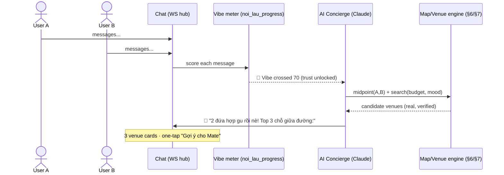
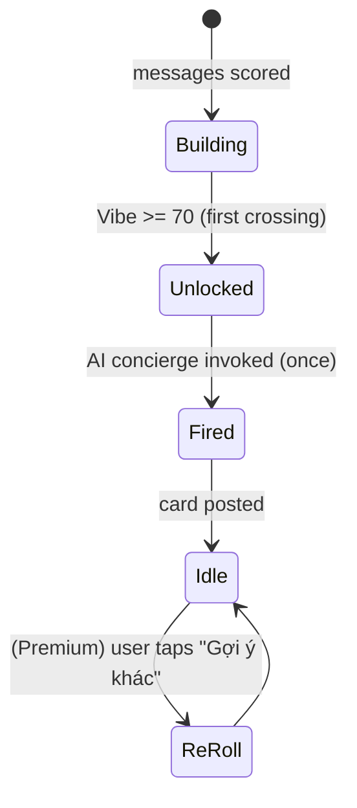
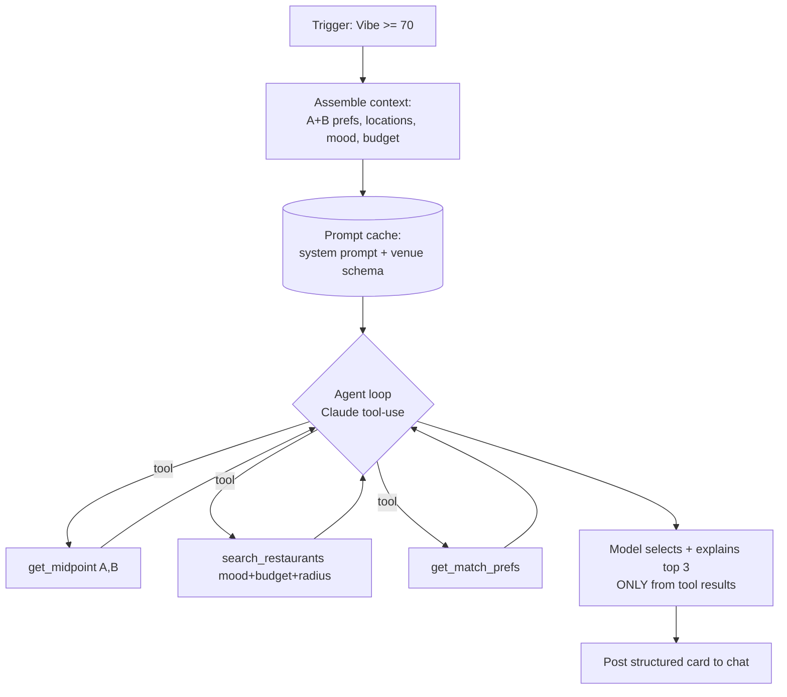
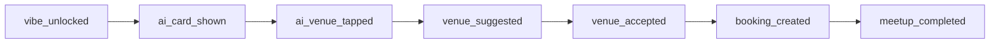
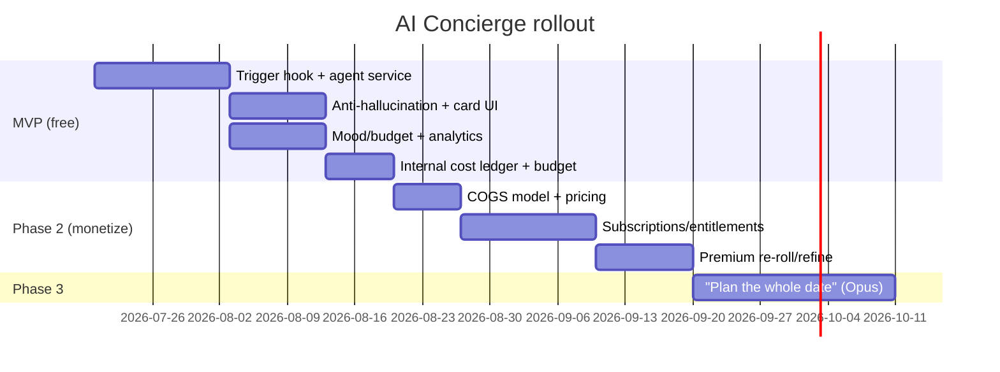

# ĂnMates — AI Concierge Agent & Monetization Plan

> **Companion to** [meetup-map-master-plan.md](meetup-map-master-plan.md). The master plan designs the *structured* map/venue/booking engine; this doc designs the **AI Concierge** that sits on top of it and the **monetization** around it.
> **Status:** Design · ready for review
> **Date:** 2026-06-03
> **Core decision:** A **proactive, triggered agent** (not a chatbot). It fires when a match's **Vibe meter crosses the trust threshold** and posts the **top-3 midpoint venues** matching both users' mood + budget. Free in MVP; premium extras monetized in Phase 2 via **consumer quotas, never user-facing tokens**.

---

## 1. The core mechanic (product vision)



**In words:** two people chat → the Vibe ("Nồi lẩu") fills → at the **trust threshold (70)** the AI concierge **jumps into the conversation on its own** and posts a card with the **top 3 restaurants** that are:

1. **Within both people's budget**,
2. **Matching both people's mood / vibe**, and
3. **Located at the midpoint between them**.

Each card has a one-tap **"Gợi ý cho Mate"** → drops straight into the existing venue-suggestion → booking flow. The agent removes the single hardest moment in the funnel ("ok we vibe... now *where*?") at the exact instant the users are most ready.

---

## 2. Why triggered > chatbot (and why this is the right monetization shape)

| Concern | Chatbot you query | **Triggered agent (chosen)** |
|---------|-------------------|------------------------------|
| **UX** | User must think to ask | Magical, unprompted payoff at peak intent |
| **Cost** | Unbounded per-message inference | ~**1 invocation per match milestone** — naturally bounded |
| **Limit UX** | Needs a visible meter (anxiety) | Core moment is **free & uncapped**; only *extras* are quota'd |
| **Funnel fit** | Generic | Fires exactly at Vibe-unlock, the conversion-critical moment |

> **Key insight:** the Vibe-threshold trigger *is* the rate limiter. You don't need to expose tokens. Monetization comes from **premium actions on top of the free moment** (re-roll, refine, full-date planning), which are clean consumer quotas.

---

## 3. The trigger — integrating with the existing Vibe meter

The Vibe meter already exists: `noi_lau_progress(match_id, points, level, last_activity)`, scored per message server-side, **threshold 70 unlocks First Date**. We hook the *same* event.



**Trigger rules:**
- Fire **once** on the *first* crossing of the threshold per match (idempotent — guard with a `ai_concierge_runs` row).
- **Preconditions** (else defer, don't fire a bad card): both users have a usable location (`user_locations`), ≥1 budget signal each, and ≥N candidate venues exist near the midpoint.
- If preconditions fail → fall back to enabling the manual "Chọn quán" CTA (existing behavior) + a soft "Bật vị trí để mình gợi ý chỗ giữa đường nha" nudge.
- **Re-fire** only via explicit user action (Premium re-roll) or a meaningful context change (location changed, budget edited).

---

## 4. Agent architecture (built on Claude)



- **Runtime:** Anthropic SDK, **tool use** loop. The agent never invents venues — it can only choose from `search_restaurants` results (see §8 anti-hallucination).
- **Models:** **Haiku** for the common path (constraints are mostly structured → cheap); escalate to **Sonnet** only when reasoning over conflicting prefs / ambiguous mood. (Opus reserved for future "plan the whole date" premium flows.)
- **Prompt caching:** cache the system prompt + tool schemas + (optionally) a compact district venue digest → large cost cut on the high-frequency path.
- **Streaming:** stream the card so the "AI is finding spots…" beat feels alive.
- **Output contract:** strict JSON (3 venues + per-venue one-line reason + a short intro line), validated before posting. Reject + retry once on malformed output.

---

## 5. Agent tools (mostly the APIs we already designed)

| Tool | Backs onto | Purpose |
|------|-----------|---------|
| `get_midpoint(match_id, mode)` | `GET /recommended-midpoints` (§6) | travel-fair center between A & B |
| `search_restaurants(lat,lng,radius,cuisine[],price_band,open_now)` | `GET /restaurants/nearby|search` (§7) | candidate venues (real, verified, `status='active'`) |
| `get_match_prefs(match_id)` | users.food_tags/vibe_tags + budget + `noi_lau_progress` | blended taste/mood/budget for the pair |
| `create_venue_suggestion(...)` *(optional, user-confirmed)* | `POST /venue-suggestions` (§10) | only after a user taps — agent never books autonomously |

> Reuse over rebuild: the concierge is a thin intelligent layer over the master-plan APIs. Booking/suggestion always require an explicit human tap — the agent **proposes**, the user **commits**.

---

## 6. Deriving the three inputs

**① Mood / vibe (both people):**
- Base: intersection + union of `users.vibe_tags` and `food_tags` for A and B.
- Boost: lightweight sentiment/topic signal from recent chat (already PII-redacted + scored server-side) — e.g. "lãng mạn / yên tĩnh" vs "vui nhộn / nhậu". Keep this as a coarse mood label, not deep chat mining (privacy + cost).
- Optional: `personality_score` / zodiac-element flavor for copy tone (brand voice), not for filtering.

**② Budget (both people):**
- **Gap today:** there is no explicit budget field on `users`. **Recommendation:** add a `budget_band` preference (captured in Food Preferences onboarding, or inferred from wishlist/history). Until then, infer a conservative shared band = `min(A_band, B_band)` with a sensible default (e.g. 80–150k).
- The card must respect the **lower** of the two budgets to avoid putting either person on the spot.

**③ Midpoint:** from `user_locations` via the §6 engine (V2a Haversine MVP → V2b Mapbox Matrix for true travel-fair midpoint). Never expose raw coordinates — output is venues only.

---

## 7. The top-3 card (UX)

```
┌───────────────────────────────────────┐
│ 🍜 2 đứa hợp gu rồi nè! Đây là 3 chỗ   │
│    ngon, vừa túi tiền, nằm giữa 2 đứa: │
│ ┌───────────────────────────────────┐ │
│ │ 1. Bún Bò Giáo Toàn  ★4.6 · ~6'   │ │
│ │    "Yên tĩnh, hợp first date" 💬   │ │
│ │              [ Gợi ý cho Mate → ]  │ │
│ ├───────────────────────────────────┤ │
│ │ 2. ...                             │ │
│ │ 3. ...                             │ │
│ └───────────────────────────────────┘ │
│   [ 🔄 Gợi ý khác (Premium) ]          │
└───────────────────────────────────────┘
```

**States:** *finding* (streaming shimmer) · *delivered* (3 cards) · *partial* (<3 found → show what exists + widen) · *blocked* (preconditions fail → location nudge) · *re-roll* (Premium).
**Tokens/brand:** locked palette + Be Vietnam Pro copy; card is a first-class chat message type rendered by the existing chat renderer (same hook as venue-suggestion cards in the master plan).

---

## 8. Anti-hallucination (non-negotiable)

A dating app cannot send users to a restaurant that doesn't exist or isn't safe.

- The agent **may only output venues returned by `search_restaurants`** (which only returns curated, `status='active'`, real DB rows ingested via **Goong** per master-plan §7 — Google is prohibited in VN). Venue identity = `restaurant_id`; the model picks IDs, it never writes a name/address freehand.
- Post-generation **validation**: every `restaurant_id` in the output must exist in the tool results; drop any that don't; if <1 valid → fall back to manual flow.
- Distances/ETAs come from tools, not the model.

---

## 9. Model & cost strategy

| Lever | Approach |
|-------|----------|
| **Model routing** | Haiku default; Sonnet only on ambiguous/conflicting prefs |
| **Prompt caching** | Cache system prompt + tool schema + district venue digest (biggest saver on the per-trigger path) |
| **Bounded invocation** | 1 free run per match milestone; re-rolls are quota'd |
| **Tool-result trimming** | Pass top-K candidates (e.g. 12) to the model, not the whole district |
| **Output cap** | Strict small JSON (3 items) → low output tokens |
| **Internal token budget** | Per-tier monthly budget enforced server-side (invisible to users) as the margin backstop |

---

## 10. Monetization

### Principles
- **Phase 1 = no paywall** (locked thesis). The concierge ships **free** in MVP to gather the behavioral data that proves its value.
- **Phase 2 = monetize the extras**, sold as **consumer outcomes/quotas — never token meters.**

### Tier design (Phase 2 proposal)

| Capability | Free | **Premium (subscription)** |
|------------|------|----------------------------|
| Auto top-3 on Vibe unlock | ✅ (the magic moment stays free) | ✅ |
| Re-roll / "Gợi ý 3 chỗ khác" | ❌ or 1/day | ✅ several/day (fair-use) |
| Refine ("rẻ hơn", "gần em hơn", "quán nhậu") | ❌ | ✅ |
| "Plan the whole date" (venue + time + backup) | ❌ | ✅ |
| Priority / trending venue access | ❌ | ✅ |

**What the user sees:** *"Premium: trợ lý AI lên kèo không giới hạn"* / *"5 lượt gợi ý lại mỗi ngày"* — outcomes, not tokens. Token budgets live entirely server-side.

### Why this respects the funnel
The conversion-critical moment (auto top-3 at Vibe unlock) is **always free**, so monetization never blocks the core loop — it sells *power-user convenience* on top.

---

## 11. Unit economics (flag for finance)

Per active premium user you stack: **Goong data (amortized; VN provider — Google is prohibited in VN) + LLM inference per run + (V2) Goong routing**. The subscription must clear blended COGS.

- Biggest cost = LLM runs × users. Mitigated by: trigger-bounding (1 free run/milestone), Haiku-first, prompt caching, K-trimmed tool results.
- **Action:** build a simple COGS model (runs/user/month × blended model cost − cache savings) before pricing. Internal per-tier token budget caps the tail.

---

## 12. Privacy & safety guardrails

- **No PII / no raw location** in agent context or output — venues only; coordinates stay server-side (consistent with master-plan §13).
- **Prompt-injection defense:** chat content enters the agent only as *coarse mood signal*, sandboxed and quoted — never as instructions. The agent's only authority is selecting venue IDs.
- **Safe venues only:** `status='active'`, verified, public (the curation gate from master-plan §7).
- **No autonomous commitments:** agent never books/suggests without an explicit user tap.
- **Transparency:** label AI messages clearly ("Trợ lý ĂnMates"); easy to dismiss; respect Block/Report (a blocked match stops all agent activity).

---

## 13. Failure & edge cases

| Case | Handling |
|------|----------|
| One user has no location | Defer trigger; nudge to enable location; fall back to manual "Chọn quán". |
| Budgets far apart | Respect the lower band; if no venues fit, widen radius before relaxing budget; tell users gently. |
| <3 venues at midpoint | Show what exists (1–2) + "muốn xem xa hơn?"; never pad with low-quality/unverified. |
| Malformed model output | Validate → retry once → fall back to manual flow. |
| Re-roll spam (cost) | Quota + cooldown; cache prior candidates to avoid recompute. |
| Both users idle after card | One soft follow-up later; then stop (no nagging). |

---

## 14. Analytics — AI attribution funnel



Track: trigger fire rate, card-shown rate, **AI-attributed suggestion/booking/completion** vs manual baseline (does the agent lift conversion?), re-roll usage, Premium conversion from re-roll paywall, cost-per-completed-meetup. These prove (or kill) the feature *and* set pricing.

---

## 15. Data model additions

```mermaid
erDiagram
    matches ||--o| ai_concierge_runs : "fired once+"
    ai_concierge_runs ||--o{ ai_concierge_picks : produced
    restaurants ||--o{ ai_concierge_picks : recommended
    users ||--o| user_prefs_budget : has

    ai_concierge_runs {
        uuid id PK
        uuid match_id FK
        text trigger "vibe_unlock|reroll|refine"
        int model_cost_tokens
        text status
        timestamptz created_at
    }
    ai_concierge_picks {
        uuid id PK
        uuid run_id FK
        uuid restaurant_id FK
        int rank
        text reason
        bool tapped
    }
    user_prefs_budget {
        uuid user_id PK_FK
        int budget_band_min
        int budget_band_max
    }
```

- `ai_concierge_runs` — idempotency guard + cost ledger + analytics.
- `ai_concierge_picks` — what was shown + tap attribution.
- `user_prefs_budget` — the missing budget signal (capture in Food Preferences onboarding).
- Premium entitlement can live on a `subscriptions`/entitlements table (Phase 2; out of scope here, note dependency).

---

## 16. API additions

| Endpoint | Purpose | Notes |
|----------|---------|-------|
| *(internal)* `POST /internal/ai-concierge/run` | Invoked by the Vibe-scoring path on threshold crossing | server-to-server; idempotent per match milestone |
| `POST /ai-concierge/reroll` | Premium re-roll | auth + entitlement + quota check |
| `POST /ai-concierge/refine` | Premium refine (cheaper/closer/vibe) | auth + entitlement + quota |
| `GET /ai-concierge/runs?match_id=` | History for a match | both members only |

All follow master-plan conventions (`/api/v1`, JWT, `httputil` envelopes). Quota/entitlement errors → `RATE_LIMITED` / a new `UPGRADE_REQUIRED` code.

---

## 17. Tickets — EPIC-AI-CONCIERGE

| ID | Title | Description | Acceptance Criteria | Deps | Cx | Risks |
|----|-------|-------------|--------------------|------|----|-------|
| AI-1 | Vibe-unlock trigger hook | Fire concierge once on first Vibe≥70 crossing; idempotency via `ai_concierge_runs`. | Fires once/match; preconditions gate; defers cleanly. | master §6/§7 APIs, `noi_lau_progress` | M | Double-fire; race on scoring. |
| AI-2 | Agent service (Claude tool-use) | Tool loop, Haiku/Sonnet routing, prompt caching, streaming, strict JSON output. | Returns ≤3 valid venues from tools; cached; p95 latency budget. | AI-1 | L | Cost; latency; output validity. |
| AI-3 | Anti-hallucination validation | Enforce venue-IDs-from-tools-only + post-validation. | 0 invented venues in test corpus; drops invalid IDs. | AI-2 | M | Subtle model drift. |
| AI-4 | Top-3 chat card UI | New chat message type + states + one-tap suggest. | All states; reuses chat renderer + tokens. | AI-2 | M | Touch existing chat carefully. |
| AI-5 | Mood + budget derivation | Blend vibe/food tags + coarse chat mood; `user_prefs_budget` capture. | Reasonable mood label; budget respects lower band. | AI-1 | M | Privacy on chat mining. |
| AI-6 | Analytics + AI attribution | Event taxonomy + AI-vs-manual funnel. | Dashboards live; lift measurable. | AI-1..4 | S | — |
| AI-7 | Premium re-roll/refine + entitlement | Quota'd Premium actions; consumer-quota UX (no tokens). | Entitlement enforced; quota + cooldown; UPGRADE_REQUIRED. | AI-2, subs (Phase 2) | L | Pricing; abuse. |
| AI-8 | Internal token budget + cost ledger | Per-tier server-side budget; `model_cost_tokens` logged. | Budget caps tail; spend observable. | AI-2 | M | Mis-estimated COGS. |

---

## 18. Roadmap & rollout



- **MVP:** ship the free auto-top-3 moment; instrument the lift vs manual venue selection.
- **Gate to Phase 2:** only monetize if analytics show the agent meaningfully lifts booking/completion *and* COGS model closes. Otherwise keep it as a free retention feature.
- **Dependency:** Premium tiers require a subscriptions/entitlements system (not yet in the app) — Phase 2 prerequisite.

---

## 19. Open decisions

1. **Budget capture** — add `budget_band` to onboarding now (recommended) vs infer from history?
2. **Chat mood mining depth** — coarse label only (recommended, privacy-safe) vs richer sentiment?
3. **Free re-roll** — 0/day or 1/day on Free tier? (affects cost + upsell pressure)
4. **Subscription infra** — build entitlements in-house vs store IAP (App Store / Play) — Phase 2 decision with tax/fee implications in VN.
5. **Pricing** — set after the COGS model (§11) + MVP lift data.

---

*This agent is a thin intelligent layer over the master-plan engine: it proposes, the human commits. Ship it free, prove the lift, then monetize the convenience — never the magic moment, and never with a token meter.*
