# ĂnMates — Meetup & Dining Map Master Plan

> **Status:** Design complete · ready for implementation
> **Author:** Cross-functional team (Product, UX, Flutter, Architecture, Backend, QA, Growth)
> **Date:** 2026-06-03
> **Scope:** Map-based meetup planning experience — how matched users *find, evaluate, agree on, and book* a restaurant together.

---

## How to read this document

The map is **not** the product. ĂnMates is a *place-first* matchmaking app: two people who both crave the same restaurant get matched, chat, agree on a venue, book, and dine. The map exists to remove the friction in **"where do we actually meet?"** — the single biggest drop-off between *match* and *meal*.

This plan is grounded in the **real codebase**, not an idealized one:

- **Frontend** (`anmates_flutter/`): Flutter, **Provider + Navigator 1.0**, layer-first `lib/`. `flutter_map: ^8.3.0`, `latlong2`, and `geolocator` are **already in `pubspec.yaml` but unused**. [`lib/services/places_service.dart`](../anmates_flutter/lib/services/places_service.dart) already fetches restaurants from the **OSM Overpass API**. [`lib/views/map_demo/`](../anmates_flutter/lib/views/map_demo/) exists but is empty.
- **Design tokens are locked** in [`lib/theme/app_theme.dart`](../anmates_flutter/lib/theme/app_theme.dart): Berry Crush `#B8336A`, Ocean Twilight `#534BA8`, Wisteria `#C490D1`, Mint Cream `#F1FFF8`, Caviar Ink `#121212`; fonts Plus Jakarta Sans (display) / Be Vietnam Pro (body).
- **Backend** (`anmates-api/`): Go Fiber v2, raw SQL over `pgxpool`, `/api/v1` routes, JWT middleware (`middleware.UserID(c)`), `httputil.OK/Err` response envelopes, embedded SQL migrations (latest `005_culture_tags.sql`). Existing tables: `users`, `matches`, `messages`, `wishlists`, `noi_lau_progress`, `user_photos`, `refresh_tokens`. **No restaurant/venue/booking/location tables exist yet.**

Three confirmed strategic decisions shape every recommendation below:

1. **Architecture — pragmatic incremental.** Introduce **Riverpod + feature-first** *only* for the new `map` / `restaurants` / `booking` features. They coexist with the existing Provider code. No full-app refactor.
2. **Map SDK & data — evaluated in §9 / §7.** Render: **flutter_map + OSM tiles** (free, already wired). Data + routing: **Goong (goong.io), a Vietnamese provider** — because **Google Maps Platform is prohibited in Vietnam** (§7). Goong supplies Places + Directions/Matrix (ETA + midpoint).
3. **Map scope — core MVP now.** This plan supersedes the earlier "no full map in Phase 1" decision: an interactive Map Discovery surface becomes part of MVP, reusing the existing geofence + booking + match foundations.

---

# SECTION 1 — Executive Summary

### Product Vision

> **Turn a match into a meal.** ĂnMates pairs people who want to eat the same food; the map closes the last mile — letting two strangers confidently agree on *where*, see it's real and safe, and book it in under two minutes of chat.

The map is a **decision accelerator**, not a discovery toy. Every surface is optimized for the question "should *we* meet *here*?" rather than "what restaurants exist?".

### Business Goals

| # | Goal | Why it matters |
|---|------|----------------|
| B1 | Lift **match → booking** conversion | Bookings are the core funnel event; today venue selection is an unstructured chat negotiation that stalls. |
| B2 | Lift **booking → completed meetup** rate | Completed meals drive reviews, Trust Score, and word-of-mouth — the retention engine. |
| B3 | Capture **structured venue + location intent data** | Powers the V2 midpoint engine, trending rails, and future monetization (featured venues). |
| B4 | Keep **infra cost near-zero at MVP** | Phase 1 is "ultimate-for-all" — no paywall. OSM/Overpass = $0 map billing while we validate. |

### User Goals

- **Find** a place that's convenient for *both* of us, fast.
- **Trust** that the place is real, open, in-budget, and safe to meet a stranger.
- **Agree** without an awkward back-and-forth ("anywhere is fine" → paralysis).
- **Arrive** without getting lost or feeling unsafe on the day.

### Success Metrics

| Metric | Definition | MVP target |
|--------|-----------|-----------|
| Venue Suggestion Rate | matches that send ≥1 venue suggestion | ≥ 55% |
| Venue Acceptance Rate | suggestions accepted | ≥ 60% |
| Booking Conversion | accepted venue → booking created | ≥ 80% |
| Meetup Completion | booking → both check-in | ≥ 70% |
| Search Success Rate | searches that lead to a detail view | ≥ 65% |
| Map TTI (web) | time-to-interactive of Map Discovery | ≤ 2.5 s on 4G |
| Map crash-free sessions | — | ≥ 99.5% |

### MVP Scope (ship first)


- Map Discovery (nearby restaurants, search, filter chips, current location)
- Restaurant Detail (photos, rating, cuisine, distance, budget, hours, "Suggest to Mate")
- Venue Suggestion → Accept inside existing Chat
- Booking Map (venue + static route preview + confirm) reusing existing booking sheets
- Meetup Day (venue location, ETA, optional ephemeral location sharing)

### Future Expansion Opportunities

- **V2:** Midpoint recommendation engine, compatibility/popularity heatmap, shared live location during meetup, trending dating spots.
- **V3:** Real-time arrival tracking, AI venue recommendation, group dining (≥3 Mates), event-based meetups, featured-venue monetization.

---

# SECTION 2 — Why Maps Matter in ĂnMates

### The friction we are removing

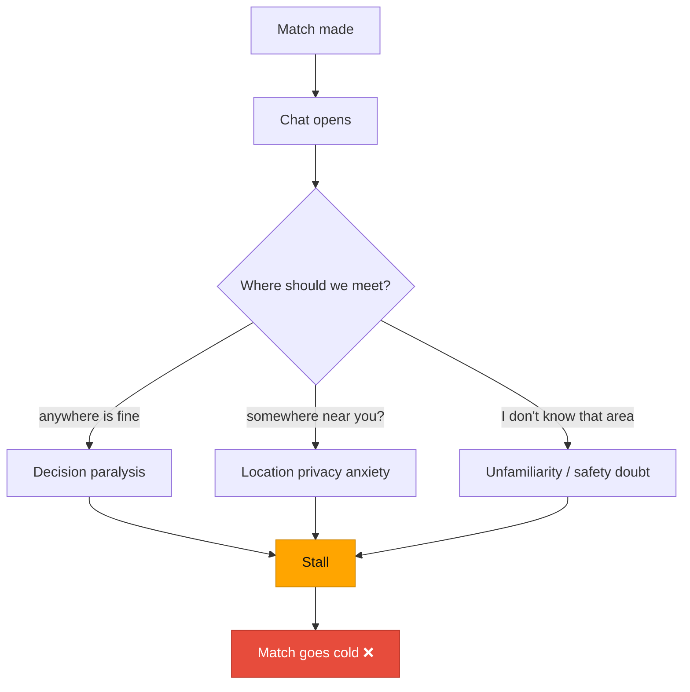

**Problems users face choosing where to meet:**

1. **Paralysis of the blank prompt.** "Where do you want to go?" with no scaffolding stalls more matches than any other moment.
2. **Asymmetric local knowledge.** One person knows the district, the other doesn't — leading to an unfair "you pick" that nobody owns.
3. **Privacy tension.** Sharing "near me" feels like leaking a home location to a stranger.
4. **Safety doubt.** Meeting a stranger demands a *public, verifiable, well-trafficked* venue — hard to assess from a name alone.
5. **Logistics drift.** Even after agreeing, "is it open Sunday?", "is it in budget?", "how do I get there?" each create a fresh chance to bail.

### Why a map changes the outcome

| Friction | Map mechanism | Funnel effect |
|----------|---------------|---------------|
| Paralysis | Pre-populated nearby markers + filter chips | More **suggestions sent** (B1) |
| Asymmetric knowledge | Shared visual reference both can see | Faster **mutual agreement** |
| Privacy | Suggest *venues*, never raw user location; ephemeral, opt-in day-of sharing | Higher **suggestion rate** without anxiety |
| Safety | Verified public venues, ratings, photos, open hours | Higher **acceptance + completion** (B2) |
| Logistics | Distance, budget, hours, route preview on one card | Higher **booking conversion** (B1) |

### Conversion thesis

Each map surface converts a *fuzzy negotiation* into a *concrete object* (a restaurant card) that can be sent, accepted, and booked with single taps. Replacing free-text negotiation with **structured, tappable artifacts** is the core conversion lever.

### Retention thesis

Completed meetups → reviews → Trust Score → more matches → more meals. The map increases *completion* (people actually show up to a place they could see and trust), which feeds the existing Trust/review loop that drives D7+ retention. It also captures **location + venue-intent data** that powers the V2 midpoint and trending features — making the product smarter the more it is used.

---

# SECTION 3 — Map Feature Strategy

### MVP — "agree on a place, fast and safely"

| Feature | Rationale |
|---------|-----------|
| **Nearby Restaurants** | The anti-paralysis default; reuses existing Overpass fetch in `places_service.dart`. |
| **Restaurant Search** | Lets a user with intent jump straight to a known venue. |
| **Restaurant Detail** | The evaluation surface — turns a name into a confident decision. |
| **Suggest Venue to Match** | The core conversion action; produces a structured, acceptable artifact in chat. |
| **Current Location** | One-tap recentre; foundation for distance display. |
| **Restaurant Selection During Booking** | Closes the loop into the existing booking flow. |

### V2 — "make it smart and shared"

| Feature | Rationale |
|---------|-----------|
| **Midpoint Recommendation** | Removes the asymmetric-knowledge problem entirely — the system proposes fair venues. Needs accumulated location data + routing API. |
| **Compatibility / Popularity Heatmap** | Surfaces where successful dates happen; social proof to break ties. |
| **Popular Dating Locations** | Trending rail re-ranked from real booking data; reuses existing "hot quanh bạn" pattern. |
| **Shared Location During Meetup** | Opt-in, ephemeral; reduces "where are you?" friction on the day. |

### V3 — "real-time and intelligent"

| Feature | Rationale |
|---------|-----------|
| **Real-Time Arrival Tracking** | Live ETA + arrival; upgrades the card-based Live Tracking to true geo. Needs Goong Directions/Matrix (VN provider). |
| **Group Dining (≥3)** | New monetizable surface; multi-party midpoint. |
| **AI Venue Recommendation** | LLM/ranking model over taste + history + context (weather, time, budget). **→ Designed in detail in [ai-concierge-plan.md](ai-concierge-plan.md): a triggered agent that auto-posts top-3 midpoint venues when the Vibe meter unlocks. Considered for MVP (free) per that doc.** |
| **Event-Based Meetups** | Themed dining events; venue partnerships → monetization. |

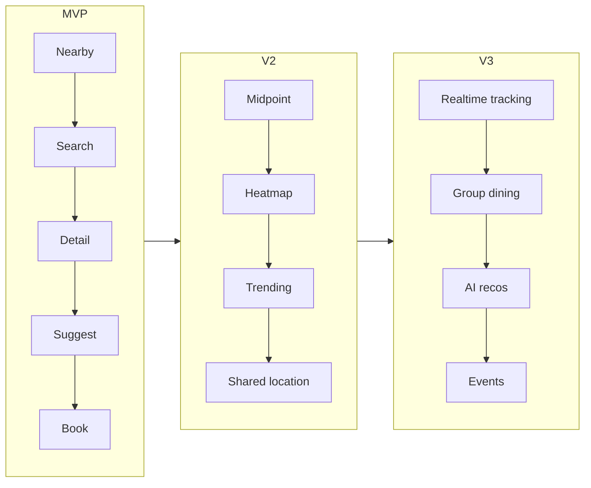

---

# SECTION 4 — User Journey Analysis

> Each journey lists **User Actions**, **System Responses**, **Success Flow**, **Failure Flow**, and **Edge Cases**, with a Mermaid diagram.

### Journey 1 — Match Success

**Actions:** User swipes right on a Mate at a restaurant they both crave → mutual right-swipe.
**System:** Server inserts swipe, detects mutual, creates `match`, opens chat thread, fires Match celebration, surfaces a **"Chọn quán" (Pick a place)** entry point into the map.
**Success:** Match screen → chat with a clear next step toward venue selection.
**Failure:** No mutual yet → swipe stored, deck continues.
**Edge cases:** Both swipe simultaneously (idempotent mutual check); one user blocked between swipe and match (suppress match); restaurant delisted between swipe and match (match still forms, venue marked stale).

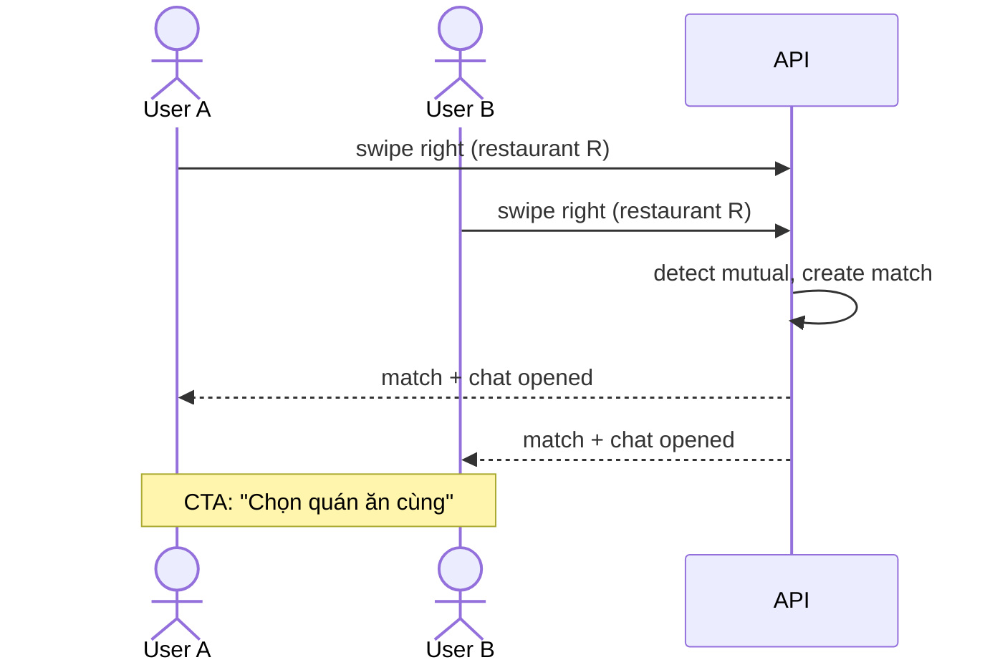

### Journey 2 — Suggest Restaurant (overview)

**Actions:** From chat, user taps "Chọn quán" → opens Map Discovery → browses/searches → opens a Restaurant Detail → taps **"Gợi ý cho Mate"**.
**System:** Builds a venue-suggestion payload (venue snapshot + optional message), posts to chat as a rich card.
**Success:** Suggestion card appears in chat for both users.
**Failure:** Network error → optimistic card shows "Đang gửi…" then retry; on hard fail, card marked failed with retry tap.
**Edge cases:** Suggesting a venue already suggested (collapse/replace prior pending suggestion); suggesting after a booking already exists (warn + confirm).

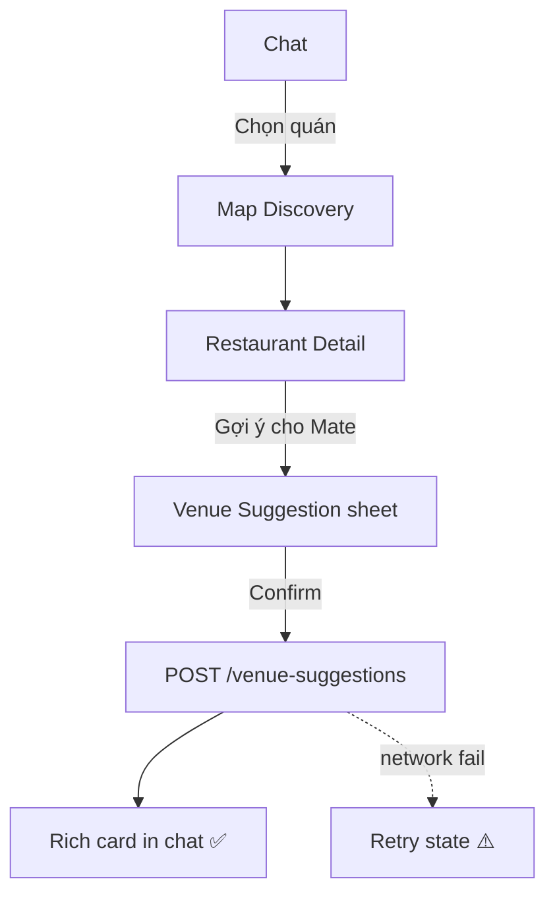

### Journey 3 — Explore Nearby Venues

**Actions:** Open Map Discovery; pan/zoom; tap filter chips (cuisine, budget, distance, open-now); tap a marker.
**System:** On map idle, debounced request loads venues in viewport; markers cluster; tapping a marker opens a bottom-sheet preview.
**Success:** Smooth markers + preview within performance budget.
**Failure:** Location denied → fall back to district centroid + banner "Bật vị trí để xem quán gần bạn".
**Edge cases:** Zero results in viewport (empty state + "mở rộng khu vực"); very dense area (clustering); rapid panning (cancel in-flight requests).

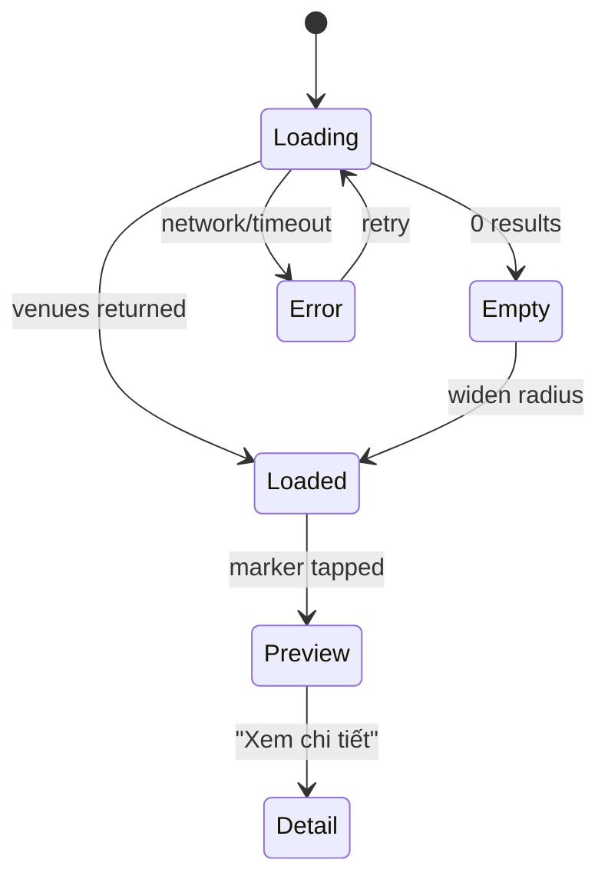

### Journey 4 — View Restaurant Details

**Actions:** From marker preview or search result, open detail; scroll photos, rating, cuisine, distance, budget, hours; tap CTA.
**System:** Fetch `GET /restaurants/{id}`; compute distance from user; show open/closed from hours; primary CTA = "Gợi ý cho Mate" (contextual when arriving from a match).
**Success:** User has enough to decide; taps suggest/book.
**Failure:** Venue not found/delisted → "Quán này không còn khả dụng" + back.
**Edge cases:** Missing photos (branded placeholder); unknown hours (show "Giờ mở cửa: đang cập nhật"); distance unknown when location denied (hide distance row).

### Journey 5 — Send Venue Suggestion

**Actions:** Review venue preview, add optional message, confirm.
**System:** `POST /venue-suggestions` with `{match_id, restaurant_id, message}`; emits a chat system/rich message via existing WS hub.
**Success:** Card delivered; sender sees "Đã gửi".
**Failure:** Validation (not your match / restaurant invalid) → inline error.
**Edge cases:** Duplicate suggestion within short window (debounce); match no longer active (block + explain).

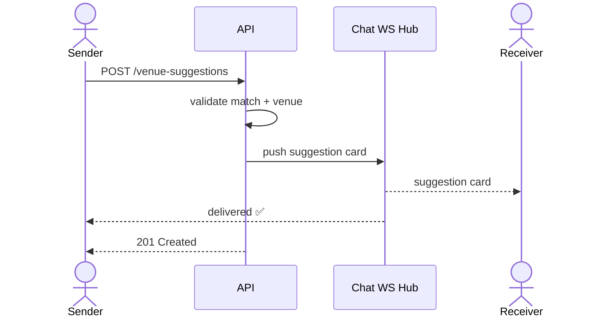

### Journey 6 — Accept Venue

**Actions:** Receiver taps "Đồng ý" on the suggestion card.
**System:** `PATCH /venue-suggestions/{id}` → status `accepted`; unlocks "Đặt lịch" (booking) CTA pre-filled with that venue.
**Success:** Both see accepted state; booking CTA active.
**Failure:** Decline → status `declined`, optional reason; sender prompted to suggest another.
**Edge cases:** Both suggest different venues (latest accepted wins; others auto-expire); accept after expiry (re-validate venue availability).

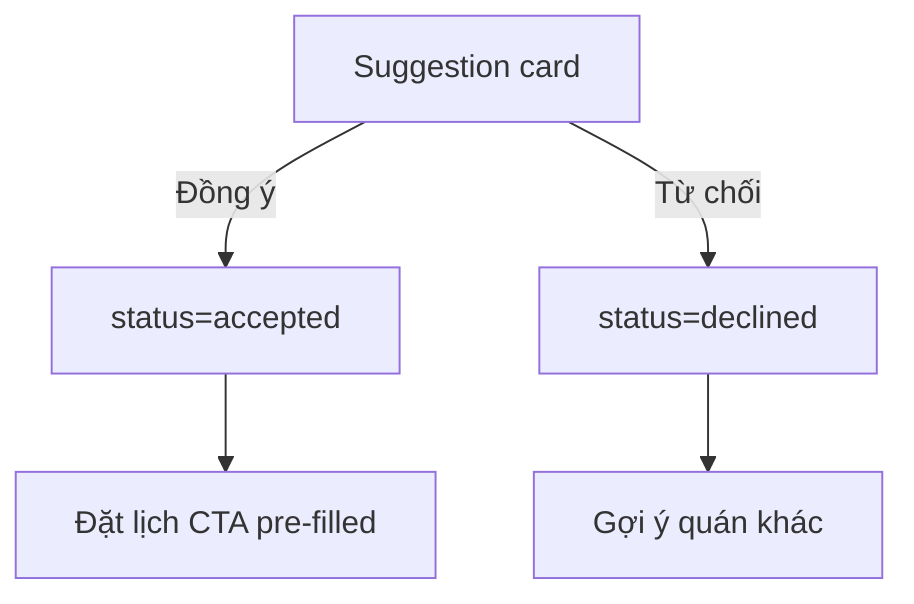

### Journey 7 — Create Booking

**Actions:** From accepted venue, open Booking Map, pick date/time/party size, confirm.
**System:** `POST /bookings` with `{match_id, restaurant_id, scheduled_at, party_size}`; state machine `pending → confirmed`; reuses existing date-scheduling sheet UI.
**Success:** Booking `confirmed`; both see Meetup card; optional calendar sync.
**Failure:** Slot conflict / venue closed at time → error + suggest nearest open slot.
**Edge cases:** One user cancels (state → cancelled, Trust impact preview); double-booking same match (block second).

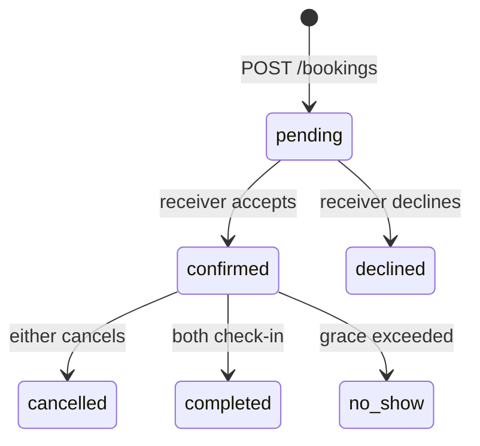

### Journey 8 — Meetup Day

**Actions:** On the day, open Meetup Day screen; see venue, ETA, directions; optionally start location sharing.
**System:** Show venue location + static route + ETA; at proximity (geofence polygon) auto check-in (reuses planned geofence logic); fires Trust event on on-time check-in.
**Success:** Both arrive, auto check-in, booking `completed`.
**Failure:** One no-show past grace → `no_show`, Trust penalty, other user prompted with options.
**Edge cases:** GPS drift near boundary (debounced/hysteresis check-in); venue moved (fallback to address pin); offline on the day (cached venue + directions deep-link).

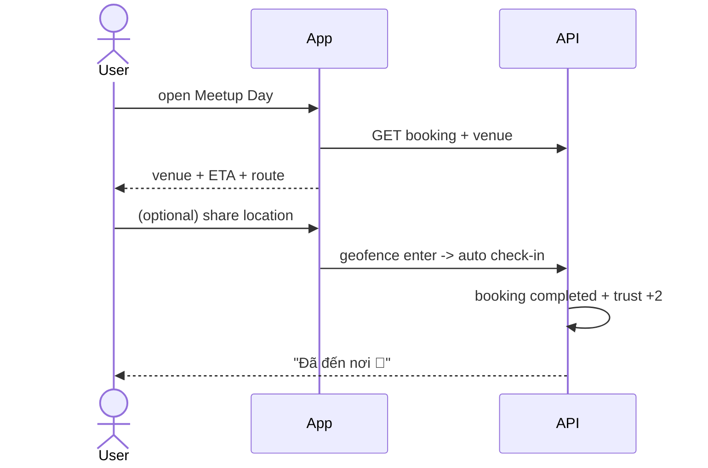

### Journey 9 — Location Sharing

**Actions:** User toggles "Chia sẻ vị trí" during an active meetup window.
**System:** Starts an **ephemeral, opt-in** session bound to the booking; streams coarse location to the matched user only; auto-stops at check-in or window end.
**Success:** Mate sees approximate live position until arrival.
**Failure:** Permission denied / background-location off → graceful "ETA only" mode.
**Edge cases:** Battery saver kills updates (fall back to last-known + timestamp); user revokes mid-session (immediately stop + notify); window expires (hard stop, purge stream).

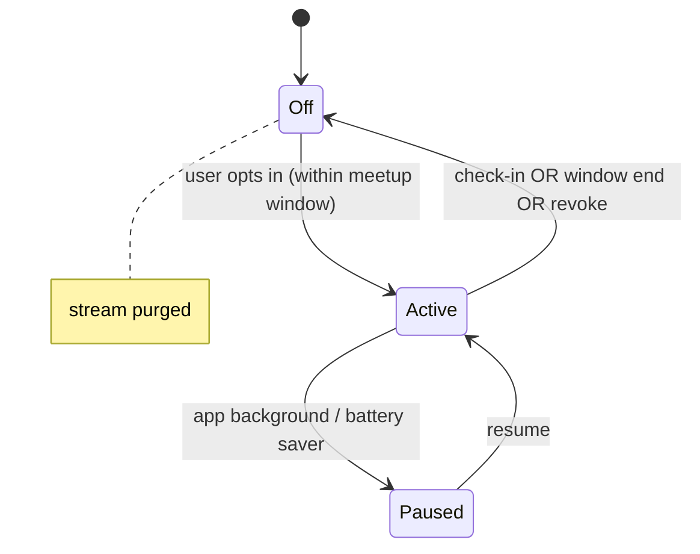

---

# SECTION 5 — Screen Planning

> Every screen uses **locked tokens** from `app_theme.dart` (`AppColors.berry`, `AppColors.ocean`, `AppColors.wisteria`, `AppColors.mint`, `AppColors.ink`) and `AppTextStyles`. Hit targets ≥ 44×44; safe-area aware; states cover default / loading / empty / error / success.

---

## 5.1 Map Discovery Screen

**Purpose:** Explore restaurants nearby and start a suggestion.

**Layout:**
```
┌─────────────────────────────────────┐
│  [🔍 Tìm quán, món ăn...        ] ✕  │  ← Search bar (floating, Mint card)
│  [ Gần đây ][ Lẩu ][ <100k ][ Mở ]   │  ← Filter chips (horizontal scroll)
│                                       │
│            🗺  MAP (flutter_map)      │
│        • clustered markers (Berry)    │
│        ◉ user location (Ocean)        │
│                                       │
│                              [ ◎ ]    │  ← Current-location FAB (bottom-right)
│ ┌───────────────────────────────────┐ │
│ │ 🏮 Quán Lẩu Cô Ba   ★4.6 · 320m   │ │  ← Bottom-sheet preview (peek)
│ │ Lẩu · 80–150k · Đang mở           │ │
│ │           [ Xem chi tiết → ]      │ │
│ └───────────────────────────────────┘ │
└─────────────────────────────────────┘
```

**Components:** Search bar, filter chips (cuisine / budget / distance / open-now), clustered restaurant markers, current-location FAB, marker bottom-sheet preview.

**States:** *default* (map + nearby markers) · *loading* (skeleton sheet + spinner over map) · *empty* (no results banner + widen-area CTA) · *error* (retry banner) · *location-denied* (district-centroid fallback + enable-location banner).

**Navigation rules:** Entry from chat "Chọn quán" CTA, from Discover tab, or deep link. Marker tap → preview; preview CTA → Restaurant Detail. Back returns to caller (chat preserves draft).

---

## 5.2 Restaurant Detail Screen

**Purpose:** Help users evaluate a venue and decide to suggest/book.

**Layout:**
```
┌─────────────────────────────────────┐
│  ◀     [ photo carousel ]      ♡     │  ← Hero photos + favorite
│─────────────────────────────────────│
│  Quán Lẩu Cô Ba          ★ 4.6 (212) │
│  Lẩu · Nướng                          │
│  📍 320m   💰 80–150k   🕒 Đang mở    │
│  ── Giờ mở cửa ──────────────────────│
│  T2–CN · 10:00–22:00                  │
│  ── Vị trí ──────────────────────────│
│  [ mini-map static preview ]          │
├─────────────────────────────────────┤
│        [  Gợi ý cho Mate  ]           │  ← Primary CTA (Berry, sticky)
│        [  Đặt lịch ngay   ]           │  ← Secondary (Outline)
└─────────────────────────────────────┘
```

**Components:** Photo carousel, rating, cuisine tags, distance, budget range, open hours, mini-map, primary "Gợi ý cho Mate" CTA, secondary book/favorite.

**States:** *default* · *loading* (shimmer) · *unavailable/delisted* (blocking message) · *partial data* (placeholders for missing photos/hours/distance).

**Navigation rules:** Entry from marker preview, search result, or a chat suggestion card. "Gợi ý cho Mate" requires an active match context → opens Venue Suggestion sheet; "Đặt lịch" → Booking Map.

---

## 5.3 Venue Suggestion Screen (bottom sheet)

**Purpose:** Share a venue with the matched user.

**Layout:**
```
┌─────────────────────────────────────┐
│            Gợi ý quán này?            │
│ ┌───────────────────────────────────┐ │
│ │ 🏮 Quán Lẩu Cô Ba   ★4.6 · 320m   │ │  ← Restaurant preview card
│ │ Lẩu · 80–150k · Đang mở           │ │
│ └───────────────────────────────────┘ │
│  ✎ [ Nhắn gì đó cho Mate... (tùy)  ] │  ← Optional message
│        [   Gửi gợi ý   ]              │  ← Confirm (Berry)
└─────────────────────────────────────┘
```

**Components:** Restaurant preview, optional message field, confirm button.

**States:** *default* · *sending* (button spinner, disabled) · *success* (sheet dismiss + chat card) · *error* (inline retry) · *blocked* (match inactive message).

**Navigation rules:** Modal over Restaurant Detail. Confirm → `POST /venue-suggestions` → dismiss → return to chat showing the card.

---

## 5.4 Booking Map Screen

**Purpose:** Finalize the meetup location and create the booking.

**Layout:**
```
┌─────────────────────────────────────┐
│  ◀   Xác nhận điểm hẹn                │
│  [ map: venue pin + static route ]    │
│─────────────────────────────────────│
│  🏮 Quán Lẩu Cô Ba · ★4.6 · 320m      │
│  📅 [ CN 08/06 ]  🕒 [ 19:00 ]        │  ← Date/time (existing sheet)
│  👥 [ 2 người ]                        │
│  💰 Khoảng 80–150k/người              │
├─────────────────────────────────────┤
│        [  Xác nhận đặt lịch  ]        │  ← Confirm (Berry, sticky)
└─────────────────────────────────────┘
```

**Components:** Venue pin, static route preview, meetup info (date/time/party/budget), booking confirmation.

**States:** *default* · *time-invalid* (venue closed at chosen time → suggest slot) · *submitting* · *confirmed* (success → Meetup card) · *conflict* (existing booking).

**Navigation rules:** Entry from accepted suggestion or Restaurant Detail "Đặt lịch". Reuses existing date-scheduling sheet. Confirm → `POST /bookings` → Meetup Day entry appears in chat.

---

## 5.5 Meetup Day Screen

**Purpose:** Help users arrive successfully and safely.

**Layout:**
```
┌─────────────────────────────────────┐
│  Hôm nay hẹn với Linh 🎉             │
│  [ map: venue + your route ]          │
│  🏮 Quán Lẩu Cô Ba                    │
│  📍 12 Lê Lợi, Q1 · 320m              │
│  ⏱ ETA ~6 phút đi bộ                  │
│  [ Chỉ đường ↗ ]  [ Chia sẻ vị trí ] │  ← Directions deep-link · ephemeral share
│  ── Mate đang ──────────────────────│
│  ◉ Linh · cách 800m (nếu đã bật)     │
└─────────────────────────────────────┘
```

**Components:** Venue location, ETA, directions deep-link, optional ephemeral location sharing, mate-status row.

**States:** *pre-window* (countdown to meetup) · *active* (ETA + share) · *sharing-on* · *checked-in* (success) · *no-show* (post-grace) · *offline* (cached venue + external directions).

**Navigation rules:** Entry from confirmed booking card or day-of push. Auto check-in via geofence. Sharing strictly bound to the meetup window.

---

# SECTION 6 — Midpoint Recommendation Engine (V2)

**Goal:** Given two users, propose fair, in-taste, in-budget venues near the travel-time midpoint — eliminating the asymmetric-knowledge problem.

### Inputs
- User A location (`lat_a, lng_a`)
- User B location (`lat_b, lng_b`)
- Cuisine preferences (intersection of `users.food_tags`)
- Budget preferences (price band)
- Distance/travel-time constraints (max minutes per side)

### Outputs
- Ranked list of recommended venues
- Per-venue travel time for each user
- Ranking score (0–1) + explanation tags

### Algorithm proposal

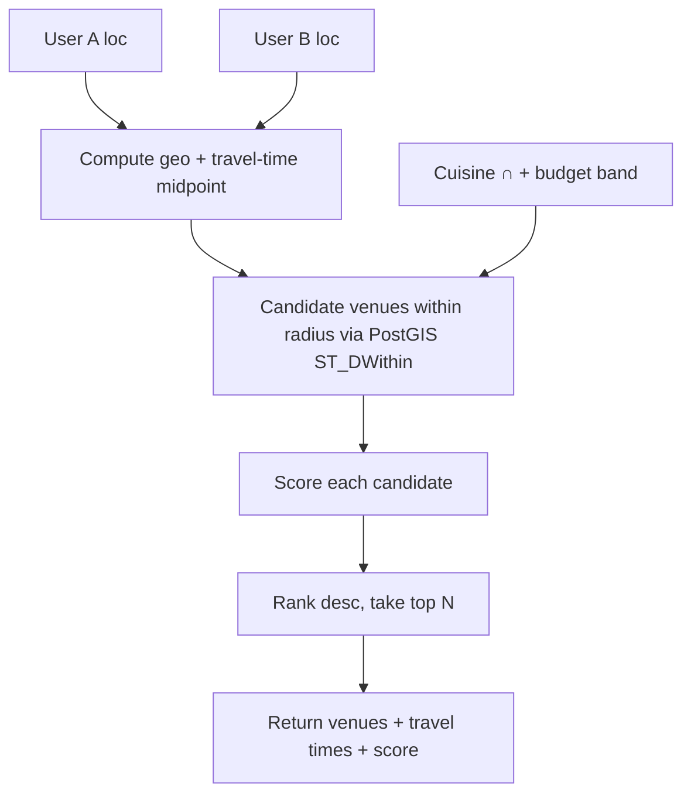

**Scoring (weighted, normalized 0–1):**

```
score = w_fair * fairness        // 1 - |t_A - t_B| / (t_A + t_B)   (balanced travel)
      + w_prox * proximity       // 1 - (t_A + t_B) / max_total
      + w_taste * cuisine_match  // |venue.cuisines ∩ shared_tags| / |shared_tags|
      + w_budget * budget_fit    // 1 if within band, decaying outside
      + w_pop  * popularity      // normalized recent successful bookings
```

Default weights: `w_fair 0.30, w_prox 0.20, w_taste 0.25, w_budget 0.10, w_pop 0.15` (tunable via config; logged for A/B).

**Phasing:**
- **V2a (cheap):** geo midpoint + Haversine distance (no routing API) → "good enough" fairness. Pure PostGIS.
- **V2b (accurate):** **Goong Distance Matrix** (VN provider — Google/Mapbox alternatives avoided since Google is prohibited in VN) for true travel times (walk/drive), cached per OD-pair for TTL.

### Backend requirements
- PostGIS extension enabled; `restaurants.geom GEOGRAPHY(Point,4326)` with GIST index.
- `GET /recommended-midpoints?match_id=&mode=walk|drive&max_minutes=` (auth: both users in match).
- `meetup_recommendations` table to persist outputs for analytics + caching.
- Rate-limit + cache Matrix calls (cost control); fall back to Haversine on quota exhaustion.

---

# SECTION 7 — Restaurant Discovery System

### Capabilities
- **Nearby search** — viewport / radius around a point (PostGIS `ST_DWithin`).
- **Keyword search** — name + cuisine trigram/`ILIKE` match.
- **Cuisine filters** — array overlap on `cuisine_tags`.
- **Distance filters** — radius bands (≤500m / ≤1km / ≤3km).
- **Price filters** — `price_min`/`price_max` band.
- **Trending** — re-ranked by recent bookings + wishlist adds within district + time slot (reuses existing "hot quanh bạn" 15-min refresh idea).

### Data model (see §11 for full schema)

`restaurants(id, name, address, district, geom, cuisine_tags[], price_min, price_max, rating, rating_count, photos[], hours_json, status, interested_count, source, source_ref, created_at)`

### API requirements (detail in §10)

| Endpoint | Use |
|----------|-----|
| `GET /restaurants/nearby` | viewport/radius markers |
| `GET /restaurants/search` | keyword + filters |
| `GET /restaurants/{id}` | detail |
| `GET /restaurants/trending` | trending rail |

### MVP data source — Goong (Vietnamese provider), NOT Google (prohibited in VN)

**Finding 1 (2026-06-03):** OSM/Overpass — what `places_service.dart` uses today — has **poor coverage of Vietnam's long-tail local eateries** (e.g. *"Bún Bò Giáo Toàn"* isn't mapped). Insufficient as the primary source for a place-first app.

**Finding 2 (2026-06-03) — CRITICAL:** **Google Maps Platform prohibits Vietnam.** Vietnam is on the official [Google Maps Platform Prohibited Territories](https://cloud.google.com/maps-platform/terms/maps-prohibited-territories) list (with China, Iran, North Korea, etc.). Places/Directions APIs may not be used with a VN billing account and are heavily rate-limited (~2400 req/day). Root cause: South China Sea territorial-dispute legal constraints. **→ Google Places API is OFF the table.**

**Decision:** Use a **Vietnamese map provider — Goong (goong.io)** as the primary data + routing source. A **server-side ingest worker** (Go background job) populates the `restaurants` table from **Goong Places API**, gated by an **admin-curation step** that flags venues `status='active'` (safety: strangers meet there). Goong is a drop-in Google replacement ("just change endpoint URL + key"), with VN-equivalent coverage of local eateries, and it **also provides Directions + Distance Matrix** — so it replaces the previously-planned Mapbox routing for §6 midpoint/ETA too. OSM/Overpass stays as a **free fallback** for mapped chains.

**Provider comparison (VN-legal):**
| Provider | Role | Note |
|----------|------|------|
| **Goong** (goong.io) ⭐ | **Primary** — Places + Directions + Matrix | Drop-in Google replacement; best VN local POI; one provider covers data **and** routing. |
| **VietMap** (vietmap.vn) | Alternative | Largest VN provider; ~70% cheaper than Google; full API set. |
| **Map4D** (iotlink) | Alternative | Pure-VN 2D/3D/4D, 63-province data warehouse. |

**Ingest usage:**
- Store Goong `place_id` as `restaurants.source_ref` (`source='goong'`); stable join key.
- Cache static fields; TTL-refresh dynamic fields (rating/hours).
- Respect Goong API terms + quota.

**Rejected sources & why:**
| Source | Verdict |
|--------|---------|
| **Google Places API** | ❌ **Prohibited in Vietnam** (Google Maps Platform Prohibited Territories) — cannot use with VN billing; severe rate limits. |
| **Playwright scrape of Google Maps** | ❌ Violates Google ToS, brittle (DOM/CAPTCHA/IP bans), legal exposure, unverified noise vs safety model. |
| **Bing Maps** | ❌ Retiring (free tier ended 2025-06-30, full 2028-06-30). |
| **Azure Maps** | ❌ TomTom POI data; weak VN long-tail coverage. |
| **Foursquare / OSM** | ⚠️ Free fallback/supplement only — insufficient as primary for VN local food. |

> Cost stance: render/tile layer stays $0 (flutter_map + OSM tiles, not Google — fine in VN). **Restaurant data + routing = Goong** (metered, VN-legal, far cheaper than Google). Favour **seed + TTL-refresh ingest** over live per-search calls to bound cost.

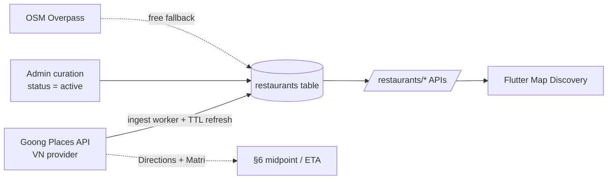

---

# SECTION 8 — Flutter Architecture

**Decision: pragmatic incremental.** New `map` / `restaurants` / `booking` features adopt **Riverpod + feature-first + repository pattern**, reusing the existing [`ApiClient`](../anmates_flutter/lib/services/api_client.dart) and design tokens. Existing Provider/Navigator-1.0 screens are **not** rewritten; the two coexist behind a single `ProviderScope` added at the root.

### Proposed structure (new code only)

```text
lib/
├── core/                      # cross-cutting (existing api_client, theme, result types)
│   ├── network/               # ApiClient wrapper (reuse), error mapping
│   └── location/              # geolocator wrapper, permission service
├── shared/                    # shared widgets (markers, restaurant card, sheets)
└── features/
    ├── map/
    │   ├── data/              # MapRepository (calls ApiClient), DTOs
    │   ├── domain/            # entities (Restaurant, Venue), value objects
    │   └── presentation/      # MapDiscoveryScreen, providers (Riverpod), widgets
    ├── restaurants/
    │   ├── data/              # RestaurantRepository
    │   ├── domain/
    │   └── presentation/      # RestaurantDetailScreen, search providers
    ├── booking/
    │   ├── data/              # BookingRepository, VenueSuggestionRepository
    │   ├── domain/
    │   └── presentation/      # BookingMapScreen, MeetupDayScreen, sheets
    ├── matching/              # (existing — read-only integration point)
    └── chat/                  # (existing — suggestion card renderer hooks here)
```

### Responsibilities

| Layer | Responsibility |
|-------|----------------|
| **presentation** | Screens + Riverpod `Notifier`/`AsyncNotifier` providers; no business logic beyond UI state. |
| **domain** | Pure entities + use-case-ish functions (distance formatting, open/closed calc); no Flutter/HTTP imports. |
| **data** | Repositories that call the existing `ApiClient`, map JSON ↔ DTO ↔ entity, own caching (extend the Overpass cache pattern). |
| **core/location** | Single `LocationService` wrapping `geolocator` + permission state, shared across features. |
| **shared** | `RestaurantCard`, `MarkerCluster`, `VenuePreviewSheet`, token-styled primitives. |

### State management pattern

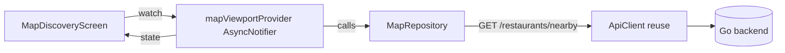

- Riverpod `AsyncNotifier` per feature surface (viewport, detail, suggestion, booking).
- Debounce + cancellation handled in the provider (map idle → request).
- Coexistence: root `ProviderScope` wraps the existing `MultiProvider`; legacy screens untouched.
- Navigation: keep Navigator 1.0 `MaterialPageRoute` for parity with existing screens (no go_router migration required for MVP).

---

# SECTION 9 — Map SDK Evaluation

> ⚠️ **Vietnam constraint:** **Google Maps Platform is prohibited in Vietnam** (§7) — Google columns below are retained for reference only; Google is **not selectable**. The VN-legal stack is **flutter_map+OSM (render) + Goong (data/routing)**.

### Comparison matrix

| Criterion | **flutter_map + OSM** | **Goong (VN)** | **Mapbox** | **Google Maps** | **HERE** |
|-----------|----------------------|----------------|-----------|-----------------|----------|
| **VN-legal** | ✅ | ✅ | ✅ | ❌ **prohibited** | ✅ |
| **Cost (MVP)** | **$0** (OSM tiles) | Low (VN pricing) | Free tier then per-MAU | Per-load billing | Freemium |
| **Already wired** | **Yes** | No (drop-in) | No | No | No |
| **VN local POI / Places** | Overpass (weak long-tail) | **Best for VN** | Good | Best globally (but blocked) | Good |
| **Routing / Matrix (ETA, midpoint)** | None native | **Directions + Matrix** | Excellent | Excellent (blocked) | Good |
| **Custom styling** | **Full** | Good | Excellent | Limited | Moderate |
| **Flutter / Web support** | Mature, web+mobile | REST APIs (drop-in) | Good | `google_maps_flutter` | Weaker |
| **Vendor lock-in** | **None** | Low (Google-compatible) | Medium | High | Medium |

### Recommendation

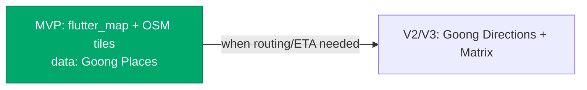

- **MVP → flutter_map + OSM/Overpass.** It's already in `pubspec.yaml`, `places_service.dart` already speaks Overpass, it's **$0**, web-friendly (we ship web), fully styleable to brand tokens, and zero new vendor risk. Markers + clustering + bottom sheets cover every MVP screen.
- **V2/V3 → use Goong Directions/Matrix** for true ETA + midpoint travel times. **Mapbox/Google routing avoided** — Google is prohibited in VN, and standardizing on one VN-legal provider (Goong) keeps data + routing consistent. flutter_map remains the render layer (can also consume Goong tiles).
- **Not Google/HERE for MVP *render*:** as a *map render SDK* Google adds billing + a heavier SDK + weaker custom styling; HERE's Flutter story is the weakest for a web-shipping app. **Bing/Azure** are also rejected as render layer (Bing retiring 2025–2028; Azure/TomTom weak VN coverage).

> **Render SDK ≠ data provider — keep them separate.** This section is about the *map render/tile layer* (recommendation: **flutter_map + OSM tiles, $0** — note: OSM, *not* Google, since **Google Maps Platform is prohibited in Vietnam**, see §7). The *restaurant data + routing source* is a distinct decision made in **§7: Goong (goong.io)**, a Vietnamese provider, ingested server-side into our DB. We render free OSM tiles **and** show Goong-sourced venue data on top — independent choices.

---

# SECTION 10 — Backend Planning

All endpoints follow existing conventions: `/api/v1` prefix, JWT middleware (`middleware.UserID(c)`), `httputil.OK/Err` envelopes, raw SQL over `pgxpool`. Success → `{success:true,data:...}`; error → `{success:false,error:{code,message}}`.

### `GET /restaurants/nearby`
**Auth:** required. **Query:** `lat, lng, radius_m (≤5000), cuisine[], price_max, open_now, limit, cursor`.
**Response:**
```json
{ "success": true, "data": {
  "items": [ { "id":"...","name":"Quán Lẩu Cô Ba","distance_m":320,
    "rating":4.6,"price_min":80000,"price_max":150000,"open_now":true,
    "lat":10.77,"lng":106.70,"cuisine_tags":["lau"] } ],
  "next_cursor": "..." } }
```
**Errors:** `VALIDATION_ERROR` (bad coords/radius), `RATE_LIMITED`.

### `GET /restaurants/search`
**Auth:** required. **Query:** `q, lat, lng, cuisine[], price_max, radius_m, limit, cursor`.
**Response:** same item shape as nearby + `meta.total`. **Errors:** `VALIDATION_ERROR`.

### `GET /restaurants/{id}`
**Auth:** required. **Response:** full venue (photos[], hours_json, address, rating_count, status). **Errors:** `NOT_FOUND` (delisted/missing).

### `GET /restaurants/trending`
**Auth:** required. **Query:** `district, slot, limit`. **Response:** ranked items + `score`.

### `POST /venue-suggestions`
**Auth:** required (must be member of match). **Body:** `{ "match_id":"...","restaurant_id":"...","message":"" }`.
**Response (201):** `{ "id":"...","status":"pending","restaurant":{...},"created_at":"..." }` and pushes a card via WS hub.
**Errors:** `VALIDATION_ERROR`, `MATCH_NOT_FOUND`, `FORBIDDEN` (not in match), `CONFLICT` (duplicate pending).

### `GET /venue-suggestions?match_id=`
**Auth:** required. **Response:** list of suggestions with status. **Errors:** `FORBIDDEN`.

### `PATCH /venue-suggestions/{id}`
**Auth:** required (receiver). **Body:** `{ "status":"accepted|declined","reason":"" }`.
**Response:** updated suggestion. **Errors:** `NOT_FOUND`, `FORBIDDEN`, `CONFLICT` (already resolved/expired).

### `POST /bookings`
**Auth:** required. **Body:** `{ "match_id":"...","restaurant_id":"...","scheduled_at":"2026-06-08T19:00:00+07:00","party_size":2 }`.
**Response (201):** `{ "id":"...","status":"pending","scheduled_at":"...","restaurant":{...} }`.
**Errors:** `VALIDATION_ERROR` (closed at time), `CONFLICT` (existing booking for match), `FORBIDDEN`.

### `GET /bookings/{id}` · `PATCH /bookings/{id}`
Status transitions per §4 Journey 7 state machine. `PATCH` body `{ "action":"confirm|cancel" }`. Cancel returns Trust-impact preview.

### `POST /bookings/{id}/checkin`
Geofence-triggered (or manual fallback). Idempotent; fires Trust event `+2` if on time.

### `GET /recommended-midpoints` *(V2)*
**Query:** `match_id, mode, max_minutes`. **Response:** ranked venues + per-user travel times + score. **Errors:** `FORBIDDEN`, `RATE_LIMITED`.

### `POST /location-sessions` / `PATCH /location-sessions/{id}` *(ephemeral, day-of)*
Opt-in, booking-bound, auto-expiring location stream. Coarse precision; receiver = matched user only.

**Cross-cutting:** all writes validate match membership; all list endpoints cursor-paginate; rate limiting reuses existing middleware; PostGIS spatial queries for nearby/midpoint.

---

# SECTION 11 — Database Design

New migrations follow the embedded pattern (`006_restaurants.sql` … `011_location_sessions.sql`). Enable PostGIS in `006`.

### Entities

```mermaid
erDiagram
    users ||--o{ matches : "user_a / user_b"
    matches ||--o{ venue_suggestions : has
    matches ||--o{ bookings : has
    restaurants ||--o{ venue_suggestions : suggested
    restaurants ||--o{ bookings : booked
    restaurants ||--o{ favorite_restaurants : favorited
    users ||--o{ favorite_restaurants : favorites
    users ||--o{ user_locations : "last known"
    matches ||--o{ meetup_recommendations : computed
    restaurants ||--o{ meetup_recommendations : candidate
    bookings ||--o{ location_sessions : "ephemeral share"

    users {
        uuid id PK
        text name
        text_array food_tags
        text_array vibe_tags
    }
    restaurants {
        uuid id PK
        text name
        text address
        text district
        geography geom "Point 4326"
        text_array cuisine_tags
        int price_min
        int price_max
        numeric rating
        int rating_count
        jsonb hours_json
        text_array photos
        text status
        int interested_count
        text source
        text source_ref
        timestamptz created_at
    }
    venue_suggestions {
        uuid id PK
        uuid match_id FK
        uuid restaurant_id FK
        uuid sender_id FK
        text message
        text status "pending|accepted|declined|expired"
        timestamptz created_at
    }
    bookings {
        uuid id PK
        uuid match_id FK
        uuid restaurant_id FK
        timestamptz scheduled_at
        int party_size
        text status "pending|confirmed|declined|cancelled|completed|no_show"
        timestamptz created_at
    }
    user_locations {
        uuid user_id PK_FK
        geography geom "Point 4326"
        text district
        timestamptz updated_at
    }
    favorite_restaurants {
        uuid user_id FK
        uuid restaurant_id FK
        timestamptz created_at
    }
    meetup_recommendations {
        uuid id PK
        uuid match_id FK
        uuid restaurant_id FK
        numeric score
        int travel_a_sec
        int travel_b_sec
        timestamptz created_at
    }
    location_sessions {
        uuid id PK
        uuid booking_id FK
        uuid user_id FK
        text status "active|ended"
        timestamptz expires_at
    }
```

### Key constraints & indexes
- `restaurants`: `GIST(geom)` for `ST_DWithin`; `(district, status)` for trending; trigram index on `name` for search; `status` default `'active'`.
- `venue_suggestions`: FK `match_id → matches`, `restaurant_id → restaurants`; partial unique index on `(match_id, status='pending')` to prevent duplicate pending.
- `bookings`: FK to matches + restaurants; unique active booking per match (partial index on `status IN (pending,confirmed)`); reuses the Journey-7 state machine.
- `user_locations`: 1:1 with users (PK = user_id), coarse precision, TTL/refresh on app foreground.
- `favorite_restaurants`: composite PK `(user_id, restaurant_id)`.
- `location_sessions`: `expires_at` enforced; background job purges ended/expired rows.

---

# SECTION 12 — Performance Strategy

| Lever | Approach |
|-------|----------|
| **Clustering** | Cluster markers client-side at low zoom (grid/supercluster); request only viewport bbox from `/restaurants/nearby`. |
| **Caching** | Extend the existing Overpass cache in `places_service.dart`; cache `/restaurants/{id}` and tiles; ETag/`Cache-Control` on read endpoints; server-side cache trending + midpoint Matrix results. |
| **Lazy loading** | Load detail photos on demand; defer mini-map render until visible; lazy-init map controller. |
| **Debouncing** | Debounce search input (~300ms) and map-idle requests (~250ms); **cancel in-flight** requests on rapid pan/zoom (provider-level). |
| **Pagination** | Cursor-paginate all list endpoints; infinite scroll on search results. |
| **Marker budget** | Cap rendered markers per viewport (e.g. ≤120); cluster the rest; prioritize by rating/distance. |
| **Spatial queries** | PostGIS `ST_DWithin` with GIST index (avoid full scans); bound `radius_m ≤ 5000`. |

**Targets:** Map TTI ≤ 2.5s (4G), 60fps panning on mid-tier devices, search results ≤ 400ms p95, crash-free ≥ 99.5%.

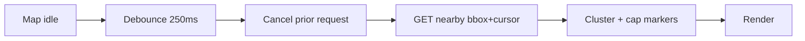

---

# SECTION 13 — Privacy & Safety

### Location permission strategy (staggered — matches existing app pattern)
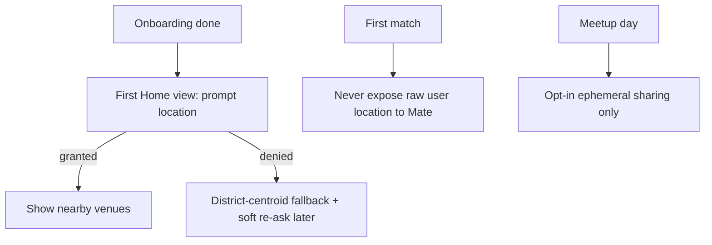

- **Consent:** Explicit, purpose-stringed permission requests; clear copy ("để gợi ý quán gần bạn"). No silent background tracking.
- **Never share raw user location.** Users suggest **venues**, not coordinates. Distance is computed server/client-side and shown only to the user themselves.
- **Temporary location sharing:** Day-of only, **opt-in**, **booking-bound**, **auto-expiring**, **coarse precision**, visible only to the matched user; revocable instantly; stream purged at check-in/window end.
- **Safe-venue verification:** Only **verified, public, well-trafficked** venues are suggestable (`status='active'` + curation flag). Surface ratings, photos, hours so users meet somewhere real. Flag/report a venue path.
- **Privacy controls:** Settings to clear last-known location, disable sharing globally, and a per-meetup toggle. Honor existing Block/Report — blocking removes any active share.

### Safety alignment with Trust system
Reuses existing Trust Score: on-time check-in → `+`, no-show → penalty. Public-venue requirement + verified data reduce risk of unsafe meetups.

---

# SECTION 14 — Analytics

### Event taxonomy

| Event | Properties | Powers metric |
|-------|-----------|---------------|
| `map_opened` | source, has_location | engagement |
| `restaurant_searched` | query, result_count, filters | Search Success Rate |
| `restaurant_viewed` | restaurant_id, source | discovery depth |
| `venue_suggested` | match_id, restaurant_id | **Venue Suggestion Rate** |
| `venue_accepted` / `venue_declined` | suggestion_id, reason | **Venue Acceptance Rate** |
| `booking_created` | booking_id, restaurant_id | **Booking Conversion** |
| `meetup_completed` | booking_id, on_time | **Meetup Completion Rate** |
| `location_share_started` / `_ended` | booking_id, duration | sharing adoption |

### Derived dashboards
- **Funnel:** match → suggest → accept → book → complete (per district, per cuisine).
- **Most Popular Restaurants:** by bookings + completions (feeds trending + V2 heatmap).
- **Search Success Rate:** searches → detail view → suggestion.
- **Cohort retention vs meetup completion** (validates the retention thesis in §2).

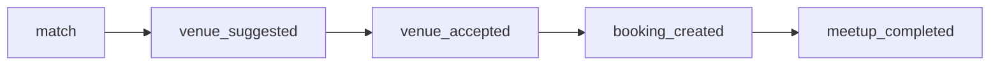

---

# SECTION 15 — QA Strategy

| Level | Coverage |
|-------|----------|
| **Unit** | Distance/open-closed calc, scoring function (§6), DTO mapping, repository error mapping, Go service validation + SQL builders. |
| **Widget** | Map Discovery states (default/loading/empty/error/denied), Restaurant Detail partial-data, Venue Suggestion send states, Booking Map time-invalid, Meetup Day sharing states. |
| **Integration** | Riverpod providers ↔ `ApiClient` against a test server; Go handlers ↔ Postgres (PostGIS) with fixtures; WS suggestion-card delivery. |
| **E2E** | Full path: match → map → detail → suggest → accept → book → meetup-day check-in. Playwright on the Flutter **web** build (reuses existing QA harness + screenshot baselines). |

### Scenario coverage matrix

| Area | Must-test |
|------|-----------|
| Search | empty query, no results, filters combine, pagination, debounce/cancel |
| Maps | clustering, viewport load, location-denied fallback, rapid pan cancellation |
| Venue suggestion | happy path, duplicate pending (CONFLICT), match inactive (FORBIDDEN), WS delivery, retry |
| Booking | closed-at-time, conflict, cancel + Trust preview, state transitions |
| Location sharing | opt-in/opt-out, expiry, revoke mid-session, permission denied, background |

**Commands:** `flutter test` (unit/widget), Go `go test ./...` (handlers/services), Playwright E2E on web build with visual regression against `screenshots/baseline/`.

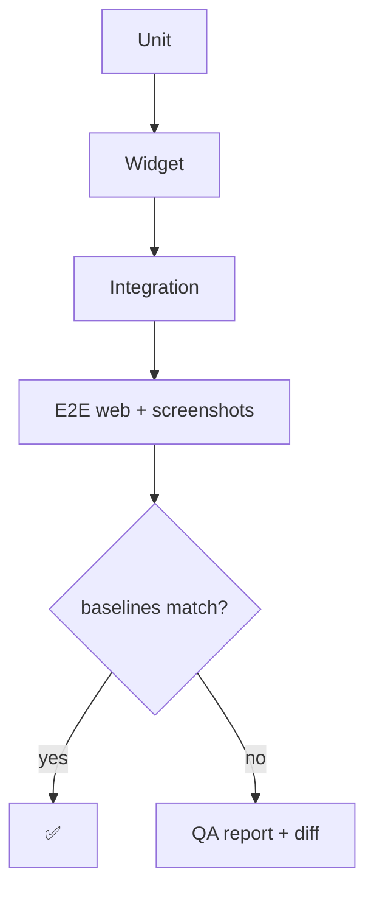

---

# SECTION 16 — Development Roadmap

### MVP (Restaurant discovery + booking support)

```mermaid
gantt
    dateFormat  YYYY-MM-DD
    title ĂnMates Map — Roadmap
    section MVP
    PostGIS + restaurants table + ingest      :m1, 2026-06-08, 7d
    Restaurant APIs (nearby/search/detail)    :m2, after m1, 7d
    Map Discovery + Detail (flutter_map)      :m3, after m1, 10d
    Venue suggestion API + chat card          :m4, after m2, 6d
    Booking Map + bookings API                :m5, after m4, 7d
    Meetup Day + geofence check-in            :m6, after m5, 6d
    QA + E2E + hardening                      :m7, after m6, 7d
    section V2
    Midpoint engine (Haversine -> Matrix)     :v1, after m7, 14d
    Heatmap + trending rail                   :v2, after v1, 10d
    Ephemeral live sharing                    :v3, after v2, 10d
    section V3
    Realtime tracking (Goong routing)         :w1, after v3, 14d
    Group dining + AI recos                   :w2, after w1, 21d
```

### Dependencies
- `m2/m3/m4` depend on `m1` (schema + data). `m5` depends on `m4` (accepted venue). `m6` reuses existing geofence design. V2 midpoint depends on accumulated `user_locations` + booking data. V3 realtime depends on Goong routing adoption (gated on V2 cost telemetry).

### Team allocation
- **1 Backend (Go)** — migrations, PostGIS, APIs, ingest job.
- **2 Flutter** — one on map/restaurants, one on booking/meetup + chat integration.
- **1 UX** — finalize 5 screens against locked tokens; wireframe → spec.
- **1 QA** — widget/integration/E2E + baselines.
- **PM + Growth (shared)** — analytics events, funnel dashboards, metric targets.

---

# SECTION 17 — Ticket Generation

> Complexity: **S / M / L / XL**. All tickets inherit: follow existing conventions (httputil envelopes, JWT, locked tokens, raw SQL + migrations), add tests.

## EPIC-MAP-DISCOVERY

| ID | Title | Description | Acceptance Criteria | Deps | Cx | Risks |
|----|-------|-------------|--------------------|------|----|-------|
| MAP-D-1 | Add `ProviderScope` + feature scaffold | Wrap root in Riverpod `ProviderScope` coexisting with `MultiProvider`; create `features/map` tree. | App builds; existing Provider screens unaffected; map feature folders exist. | — | S | Provider/Riverpod coexistence edge cases. |
| MAP-D-2 | LocationService (geolocator) | Permission + last-known wrapper in `core/location`. | Granted/denied/forever-denied handled; coarse mode; web + mobile. | MAP-D-1 | M | Web geolocation quirks. |
| MAP-D-3 | Map Discovery screen (flutter_map) | Tiles, user marker, clustered restaurant markers, current-location FAB. | Renders nearby markers; 60fps pan; denied → centroid fallback. | MAP-D-2, MAP-R-2 | L | Clustering perf on dense areas. |
| MAP-D-4 | Search bar + filter chips | Debounced search, cuisine/budget/distance/open-now chips. | Filters combine; debounce+cancel; empty state. | MAP-D-3, MAP-R-3 | M | Filter combinatorics. |
| MAP-D-5 | Marker bottom-sheet preview | Peek sheet → "Xem chi tiết". | Tap marker shows preview; CTA opens detail. | MAP-D-3 | S | — |

## EPIC-MAP-RESTAURANTS

| ID | Title | Description | Acceptance Criteria | Deps | Cx | Risks |
|----|-------|-------------|--------------------|------|----|-------|
| MAP-R-1 | Migration `006` PostGIS + `restaurants` | Enable PostGIS; create table + indexes. | Migration applies; GIST + trigram indexes exist. | — | M | PostGIS availability on Cloud SQL. |
| MAP-R-2 | `GET /restaurants/nearby` | Bbox/radius PostGIS query + cursor. | Returns items within radius; paginated; validated. | MAP-R-1 | M | Query perf at scale. |
| MAP-R-3 | `GET /restaurants/search` | Keyword + filters. | Trigram match; filters; pagination. | MAP-R-1 | M | Relevance tuning. |
| MAP-R-4 | `GET /restaurants/{id}` | Full detail. | 200 with photos/hours; 404 delisted. | MAP-R-1 | S | — |
| MAP-R-5 | Goong ingest + curation job | Go background worker ingests VN venues from **Goong Places API** (goong.io — Google is prohibited in VN) into the table; store `place_id`→`source_ref` (`source='goong'`); TTL-refresh dynamic fields; admin-curation flags `status='active'`; OSM fallback for chains. | ≥ launch districts populated incl. local eateries (e.g. find "Bún Bò Giáo Toàn"); verified flag set; idempotent; respect Goong quota/terms. | MAP-R-1 | L | Goong cost/quota; data dedup. |
| MAP-R-6 | Restaurant Detail screen | Photos, rating, distance, budget, hours, CTAs. | All states; partial-data placeholders; tokens. | MAP-R-4 | M | Missing data handling. |

## EPIC-MAP-VENUE-SUGGESTION

| ID | Title | Description | Acceptance Criteria | Deps | Cx | Risks |
|----|-------|-------------|--------------------|------|----|-------|
| MAP-VS-1 | Migration `007` `venue_suggestions` | Table + partial unique pending index. | Migration applies; FK + constraint. | MAP-R-1 | S | — |
| MAP-VS-2 | Suggestion APIs (POST/GET/PATCH) | Create/list/accept/decline + WS push. | Match-membership enforced; duplicate→CONFLICT; WS card delivered. | MAP-VS-1 | M | WS hub integration. |
| MAP-VS-3 | Venue Suggestion sheet | Preview + message + send states. | Send/success/error/blocked states. | MAP-R-6, MAP-VS-2 | M | Optimistic UI. |
| MAP-VS-4 | Chat suggestion card + accept | Render rich card in chat; accept/decline. | Card shows status; accept unlocks booking CTA. | MAP-VS-2 | M | Touch existing chat renderer carefully. |

## EPIC-MAP-BOOKING

| ID | Title | Description | Acceptance Criteria | Deps | Cx | Risks |
|----|-------|-------------|--------------------|------|----|-------|
| MAP-B-1 | Migration `008` `bookings` | Table + state machine + unique active index. | Migration applies; transitions constrained. | MAP-R-1 | M | State integrity. |
| MAP-B-2 | Booking APIs (POST/GET/PATCH/checkin) | Create/confirm/cancel/checkin. | Closed-time→VALIDATION; conflict→CONFLICT; cancel→Trust preview. | MAP-B-1 | L | Trust integration + idempotent check-in. |
| MAP-B-3 | Booking Map screen | Venue pin, route preview, date/time/party. | Reuses scheduling sheet; confirm creates booking. | MAP-B-2, MAP-R-6 | M | Time-slot validation UX. |
| MAP-B-4 | Meetup Day screen + geofence check-in | Venue, ETA, directions, ephemeral share, auto check-in. | Geofence triggers check-in; offline fallback. | MAP-B-2, MAP-D-2 | L | GPS drift; battery. |
| MAP-B-5 | Migration `011` + ephemeral location sessions | `location_sessions` + APIs + purge job. | Opt-in, bound, auto-expire, revocable, coarse. | MAP-B-1 | M | Privacy correctness. |

## EPIC-MAP-MIDPOINT (V2)

| ID | Title | Description | Acceptance Criteria | Deps | Cx | Risks |
|----|-------|-------------|--------------------|------|----|-------|
| MAP-MP-1 | Migrations `009/010` locations + recommendations | `user_locations`, `meetup_recommendations`. | Migrations apply. | MAP-R-1 | S | — |
| MAP-MP-2 | Midpoint engine V2a (Haversine) | Geo midpoint + candidate scoring. | Returns ranked venues + scores; config weights. | MAP-MP-1 | L | Scoring quality. |
| MAP-MP-3 | `GET /recommended-midpoints` | Auth + rate-limit + cache. | Both-member auth; cached; fallback. | MAP-MP-2 | M | Cost control. |
| MAP-MP-4 | V2b Goong Matrix travel times | True walk/drive times via Goong Distance Matrix (VN provider), cached per OD pair. | Accurate times; quota fallback to Haversine. | MAP-MP-3 | L | Goong cost + quota. |

## EPIC-QA-MAP

| ID | Title | Description | Acceptance Criteria | Deps | Cx | Risks |
|----|-------|-------------|--------------------|------|----|-------|
| QA-M-1 | Unit + widget suites | Cover calc, scoring, screen states. | All §15 widget states covered; CI green. | feature tickets | M | Flaky map widget tests. |
| QA-M-2 | Integration (Go + Postgres/PostGIS) | Handlers ↔ DB fixtures. | Spatial queries + transitions tested. | MAP-R/VS/B | M | PostGIS test container. |
| QA-M-3 | E2E web + screenshot baselines | Playwright full funnel + visual regression. | match→…→check-in passes; baselines stored. | all | L | Web map rendering determinism. |

---

# SECTION 18 — Final Recommendation

### Recommended MVP scope
Map Discovery → Restaurant Detail → Venue Suggestion (in chat) → Accept → Booking Map → Meetup Day with geofence check-in. Restaurant data ingested from OSM/Overpass into a curated, verified `restaurants` table. Ship the funnel that turns a match into a confirmed, completed meal.

### Recommended SDK + data source (two separate decisions)
- **Map render:** **flutter_map + OSM tiles** ($0, already wired, web-friendly, brand-styleable; OSM not Google — Google is prohibited in VN).
- **Restaurant data + routing:** **Goong (goong.io)**, a Vietnamese provider, ingested server-side into our `restaurants` table + admin curation; Goong also supplies Directions/Matrix for §6 midpoint/ETA. OSM is data fallback only. **Rejected:** Google Places (**prohibited in Vietnam**), Playwright scraping (ToS/legal/brittle), Bing/Azure (retiring + weak VN coverage). VietMap / Map4D are viable VN alternatives.

### Recommended architecture
**Pragmatic incremental Riverpod + feature-first** for `map/restaurants/booking` only, reusing the existing `ApiClient`, locked design tokens, and Navigator 1.0; coexisting under one `ProviderScope`. Backend extends existing Go Fiber conventions: raw SQL + PostGIS, embedded migrations, JWT, `httputil` envelopes, WS hub for suggestion cards.

### Recommended team structure
1 Backend (Go/PostGIS), 2 Flutter (map/restaurants + booking/meetup), 1 UX, 1 QA, PM + Growth shared. ~8 weeks to MVP per §16.

### Key risks
| Risk | Mitigation |
|------|-----------|
| **PostGIS on managed Postgres** unavailable/limited | Verify Cloud SQL PostGIS early (MAP-R-1 is week 1); fallback to app-side Haversine + bounding-box if needed. |
| **VN restaurant data coverage** (OSM misses local eateries) | Use **Google Places API** as primary ingest source (best VN long-tail coverage); curate + verify before exposing; `status='active'` gate; OSM fallback. |
| **Google Places cost / ToS** | Seed + TTL-refresh ingest (not live per-search); store `place_id`, refresh dynamic fields only; never scrape/bulk-mirror; monitor spend. |
| **Privacy of location sharing** | Strictly opt-in, booking-bound, coarse, auto-expiring; never share raw user coords; reuse Block/Report. |
| **Goong cost/quota (V2 routing)** | Cache Matrix per OD-pair; Haversine fallback; gate adoption on telemetry. |
| **Google Maps prohibited in VN** | Use Goong (VN provider) for data + routing; OSM tiles for render; never Google Places with VN billing. |
| **Touching existing chat/booking code** | Integrate via additive hooks; strong widget/integration tests; QA baselines. |
| **Riverpod/Provider coexistence** | Single root `ProviderScope`; no legacy rewrite; smoke test existing flows. |

### Key success factors
- **Reduce decision friction** — pre-populated, tappable venues beat blank prompts.
- **Trust by default** — verified public venues, ratings, photos, hours.
- **Privacy that earns sharing** — suggest venues not coordinates; ephemeral day-of sharing.
- **Reuse over rebuild** — Overpass fetch, ApiClient, locked tokens, geofence, WS hub, scheduling sheets all already exist.
- **Measure the funnel** — instrument match→complete from day one to validate the conversion + retention thesis.

---

*End of master plan. Implementation can begin with EPIC-MAP-RESTAURANTS (MAP-R-1: PostGIS + restaurants table) and EPIC-MAP-DISCOVERY (MAP-D-1: ProviderScope scaffold) in parallel.*
