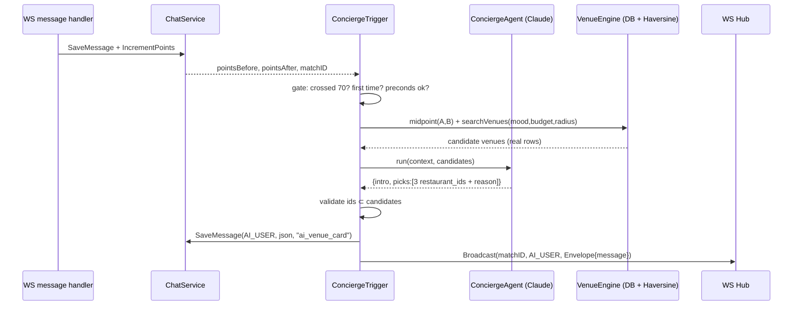

# SPEC — AI Concierge in Chat (vertical slice)

> **Spec-driven development artifact.** This is the implementation contract. Code is written *against* this spec; changes to behavior change this doc first.
> **Companion design:** [ai-concierge-plan.md](../ai-concierge-plan.md) · [meetup-map-master-plan.md](../meetup-map-master-plan.md)
> **Status:** Draft for approval · **Date:** 2026-06-03
> **Owner:** main-assistant

---

## 1. Objective

Ship the **thinnest end-to-end vertical slice** of the AI Concierge: when a matched pair's Vibe meter (`noi_lau_progress.points`) crosses **70**, the backend invokes a Claude agent that returns **top-3 real venues** (in budget, matching mood, near the midpoint), posts them into the chat as a new message type, and both users see a card with one-tap **"Gợi ý cho Mate"**.

**Definition of done:** in a local dev run, driving a match's points past 70 causes an `ai_venue_card` message authored by the AI system user to appear in both clients' chat, containing 3 seeded venues, fired exactly once.

---

## 2. Locked decisions (from product owner)

| # | Decision | Value |
|---|----------|-------|
| D1 | Trigger threshold | `points >= 70` (keep the design's "70"); configurable via `AI_TRIGGER_POINTS`, default `70`. |
| D2 | Location source | App pushes last-known location → new `user_locations` table + upsert endpoint. |
| D3 | Venue source (slice) | **Seed** `restaurants` (~30–50 real Q1 venues). Production ingest = **Goong** (Google prohibited in VN). |
| D4 | Midpoint (slice) | **Haversine** geo-midpoint in Go (no external routing). Goong Matrix is a later upgrade. |
| D5 | Agent model | **Pluggable via OpenAI-compatible `LLMClient`.** **Dev = LM Studio local** (`http://localhost:1234/v1`, $0, no key) running e.g. **Qwen2.5-7B/14B-Instruct**. Prod = swap `AI_BASE_URL`/`AI_MODEL` to a hosted endpoint (self-host GPU or cloud). Anthropic/Claude is one possible backend, not required. |
| D6 | Monetization | **Out of scope** for this slice — concierge is free; re-roll/refine are future tickets. |
| D7 | Budget | Default shared band (e.g. 80–150k) for the slice; `user_prefs_budget` capture is a follow-up. |

---

## 3. Scope

### In scope (this slice)
- DB: `restaurants` (+ seed), `user_locations`, `ai_concierge_runs` (idempotency + ledger). Migrations `006`–`008`. Seed an **AI system user**.
- Backend: location upsert endpoint; Haversine midpoint helper; venue search (DB query); **Claude agent service** (tool-use, strict JSON, anti-hallucination); **trigger hook** in the chat message path; persist + broadcast `ai_venue_card`.
- Flutter: push location on chat open; render `ai_venue_card` in `ChatDetailView`; "Gợi ý cho Mate" action.
- Tests: Go unit (midpoint, trigger gate, output validation) with a **faked LLM client**; Flutter widget test for the card.

### Out of scope (later tickets)
Monetization/quotas, re-roll/refine, Goong ingest, full Map Discovery screen, booking flow, ephemeral location sharing, Sonnet escalation, prompt-cache tuning, budget onboarding.

---

## 4. Architecture (slice)



**Reused code (do not rewrite):**
- [`services/chat.go`](../../anmates-api/services/chat.go): `SaveMessage`, `IncrementPoints` (hook point), `IsMember`.
- [`models/models.go`](../../anmates-api/models/models.go): `Message`, `NoiLauThresholds`, `LevelForPoints`.
- [`ws/hub.go`](../../anmates-api/ws/hub.go): `Hub.Broadcast(matchID, senderID, Envelope)`.
- [`internal/httputil`](../../anmates-api/internal/httputil/response.go): `OK`/`Err`. [`middleware.UserID`](../../anmates-api/middleware/auth.go).

---

## 5. Data model changes

```sql
-- 006_restaurants.sql  (slice subset of master-plan §11; PostGIS optional for slice — see note)
CREATE TABLE restaurants (
  id            uuid PRIMARY KEY DEFAULT gen_random_uuid(),
  name          text NOT NULL,
  address       text,
  district      text,
  lat           double precision NOT NULL,
  lng           double precision NOT NULL,
  cuisine_tags  text[] NOT NULL DEFAULT '{}',
  price_min     int,            -- VND
  price_max     int,
  rating        numeric(2,1),
  photos        text[] NOT NULL DEFAULT '{}',
  status        text NOT NULL DEFAULT 'active',
  source        text NOT NULL DEFAULT 'seed',   -- 'seed' | 'goong'
  source_ref    text,
  created_at    timestamptz NOT NULL DEFAULT now()
);
-- Slice uses lat/lng + Haversine in SQL/Go. PostGIS geom column added later (master-plan §11).

-- 007_user_locations.sql
CREATE TABLE user_locations (
  user_id     uuid PRIMARY KEY REFERENCES users(id) ON DELETE CASCADE,
  lat         double precision NOT NULL,
  lng         double precision NOT NULL,
  district    text,
  updated_at  timestamptz NOT NULL DEFAULT now()
);

-- 008_ai_concierge.sql
CREATE TABLE ai_concierge_runs (
  id           uuid PRIMARY KEY DEFAULT gen_random_uuid(),
  match_id     uuid NOT NULL REFERENCES matches(id) ON DELETE CASCADE,
  trigger      text NOT NULL,            -- 'vibe_70'
  status       text NOT NULL,            -- 'fired' | 'skipped_preconds' | 'error'
  message_id   uuid REFERENCES messages(id),
  model        text,
  cost_tokens  int,
  created_at   timestamptz NOT NULL DEFAULT now()
);
-- Idempotency: at most one 'fired' run per match.
CREATE UNIQUE INDEX ai_runs_one_fired_per_match
  ON ai_concierge_runs(match_id) WHERE status = 'fired';

-- AI system user (seed): fixed UUID so messages.sender_id FK is satisfied.
-- INSERT INTO users(id, name, ...) VALUES ('00000000-0000-0000-0000-0000000000AI'..., 'Trợ lý ĂnMates', ...)
```

> **Note on `messages.sender_id`:** it is a NOT-NULL FK to `users`. The AI card is authored by a **reserved system user** (fixed UUID, e.g. `AI_USER_ID`). Seed it in `008`. Flutter treats `sender_id == AI_USER_ID` as "from the assistant".

---

## 6. Message contract — `ai_venue_card`

New `messages.msg_type = "ai_venue_card"`. `content` = JSON string:

```json
{
  "intro": "2 đứa hợp gu rồi nè! Đây là 3 chỗ ngon, vừa túi tiền, nằm giữa 2 đứa:",
  "midpoint": { "lat": 10.776, "lng": 106.700 },
  "picks": [
    { "restaurant_id": "uuid", "name": "Bún Bò Giáo Toàn", "rating": 4.6,
      "price_min": 60000, "price_max": 120000, "lat": 10.77, "lng": 106.70,
      "distance_m": 480, "reason": "Yên tĩnh, hợp first date" }
  ]
}
```

- Exactly **1–3** picks. Every `restaurant_id` MUST exist in the candidate set (validated server-side).
- `name/rating/price/lat/lng/distance_m` are filled **from DB rows**, never from the model (model only chooses IDs + writes `intro` + `reason`).
- WS envelope: existing `Envelope{ Type: "message", Payload: <saved message JSON> }`, broadcast with `senderID = AI_USER_ID` so **both** users receive it.

---

## 7. Agent design (Claude, Go)

**Interface (testable — fake in tests, pluggable backend in runtime):**
```go
type LLMClient interface {
    // Returns the model's chosen picks given the prompt + candidate venues.
    Rank(ctx context.Context, in ConciergeInput) (ConciergeOutput, error)
}
```
- **Real impl = OpenAI-compatible HTTP client** (`POST {AI_BASE_URL}/chat/completions`). This single impl works with **LM Studio (local/dev, $0)**, Ollama, vLLM, and any cloud OpenAI-compatible endpoint — selected purely by env (`AI_BASE_URL`, `AI_API_KEY`, `AI_MODEL`). No code change to switch dev↔prod.
- **No native tool-calling required:** the backend pre-fetches candidates from the DB; the model does ONE structured-output call (pick IDs + write reasons). This keeps small local models viable.
- **Force valid JSON:** use `response_format` = JSON schema (LM Studio / OpenAI support structured output / GBNF grammar). Reject + retry once on schema violation.
- **Reasoning models (Qwen3, etc.):** LM Studio routes the answer into `reasoning_content` and leaves `content` empty. The client MUST fall back to `reasoning_content` when `content` is blank, then extract the `{...}`. Verified with `qwen/qwen3.5-9b`: clean Vietnamese JSON, ~1.3s, correct budget filtering. `max_tokens≈2000` gives reasoning headroom.
- Input to model: blended mood label (from `food_tags ∩/∪`, `vibe_tags`), shared budget band, and the **candidate venue list** (top-K, e.g. 12, already filtered by DB to budget + radius around midpoint).
- **Output schema (strict JSON, validated):** `{ intro: string(≤140), picks: [{ restaurant_id, reason: string(≤60) }] (1..3) }`.
- **Anti-hallucination (hard rule):** drop any `restaurant_id` not in candidates; if 0 valid → status `error`, fall back to no card (slice) / manual CTA.
- **Guardrails:** chat content is NOT fed as instructions; only a coarse derived mood label enters the prompt. No PII, no raw coordinates of users in output (only venue coords + computed midpoint).
- One retry on malformed JSON; then give up gracefully (never crash the message path).

**Cost controls:** Haiku; K-trimmed candidates; tiny output; 1 fire per match (D1 idempotency). Log `cost_tokens` to `ai_concierge_runs`.

---

## 8. Trigger semantics

Hook in the chat message path (after `IncrementPoints`). `IncrementPoints` currently returns nothing — **modify it to return `(pointsBefore, pointsAfter int)`** (or add a sibling that does), so the caller can detect the crossing.

```
fire if:  pointsBefore < AI_TRIGGER_POINTS <= pointsAfter      // first crossing
      AND no existing ai_concierge_runs row with status='fired' // idempotent
      AND preconditions:
            - both users have a user_locations row
            - >= 1 candidate venue near midpoint within budget
else:
      record status='skipped_preconds' (so we can retry on next message) OR defer silently
```

- Run the agent **asynchronously** (goroutine) so the user's message latency is unaffected. The card arrives a moment later via WS — matches the "AI jumps in" UX.
- Idempotency enforced by the partial unique index (§5). A race that inserts a 2nd `fired` row fails the unique constraint → swallow.

---

## 9. API additions

| Method | Path | Auth | Body / Result |
|--------|------|------|---------------|
| `PUT` | `/api/v1/me/location` | JWT | `{lat,lng,district?}` → upsert `user_locations`; `200 {success:true}` |
| *(internal)* | trigger | — | invoked in-process from the chat path; no public endpoint in the slice |

(Re-roll/refine endpoints from the design doc are out of scope here.)

Errors use existing `httputil.Err` codes; validation → `VALIDATION_ERROR`.

---

## 10. Config / env (backend)

```
# OpenAI-compatible — works with LM Studio (dev), Ollama, vLLM, or cloud
AI_BASE_URL         = http://localhost:1234/v1     # LM Studio local (dev). Prod: hosted endpoint
AI_API_KEY          = lm-studio                     # LM Studio ignores; cloud needs a real key
AI_MODEL            = qwen2.5-7b-instruct           # or 14b; dev model in LM Studio
AI_TRIGGER_POINTS   = 70
AI_CANDIDATE_LIMIT  = 12
AI_SEARCH_RADIUS_M  = 4000
AI_DEFAULT_BUDGET_MIN = 80000
AI_DEFAULT_BUDGET_MAX = 150000
AI_USER_ID          = <fixed uuid of system user>
```
Dev: `anmates-api/.env` pointing at **LM Studio** (no cost, no external key). Prod: set `AI_BASE_URL`/`AI_API_KEY`/`AI_MODEL` to a hosted endpoint (self-host GPU or cloud) via GCP Secret Manager. If `AI_BASE_URL` is empty/unreachable, the agent is **disabled** (no card, logged) — backend still boots.

> **Docker dev note:** the API runs in a container (`start.sh` → docker compose), so to reach LM Studio on the Windows host use `AI_BASE_URL=http://host.docker.internal:1234/v1` (NOT `localhost`), and enable "Serve on Local Network" in LM Studio. Vars live in the repo-root `.env` (see `.env.example`).
>
> **Prod inference note:** LM Studio on a laptop is dev-only — Cloud Run cannot reach localhost. Production needs a reachable inference endpoint (self-hosted GPU VM running Ollama/vLLM, or a cloud LLM API). The interface makes this a config swap, not a rewrite.

---

## 11. Flutter changes

- On entering a chat (`ChatDetailView`), call `PUT /me/location` with last-known `geolocator` position (already in pubspec; request permission per existing staggered strategy).
- Extend the message renderer: `msg_type == 'ai_venue_card'` → parse JSON → render a card listing 1–3 venues (name, rating, price, distance, reason) using locked tokens (`AppColors`, Be Vietnam Pro). Author label "Trợ lý ĂnMates" when `sender_id == AI_USER_ID`.
- Each pick has **"Gợi ý cho Mate"**. In the slice this posts a normal chat message referencing the venue (the full venue-suggestion API is a later ticket); wire it as a TODO seam, not a fake.
- Handle WS receipt of the new type (existing WS consumer already appends messages — just branch on type in the renderer).

---

## 12. Security & privacy

- AI card readable only by match members (same gate as all chat).
- No user PII / no user raw coordinates in model prompt or output; only derived mood + candidate venues + computed midpoint.
- Chat text never used as model instructions (injection-safe): only a coarse mood label derived server-side.
- Only `status='active'` venues are searchable (safety).
- API key only server-side; never shipped to Flutter.

---

## 13. Test plan & acceptance criteria

**Go unit (with fake `LLMClient`):**
- [ ] Midpoint Haversine correct for known coords.
- [ ] Trigger fires only on first crossing of 70; not at 69→69, not twice.
- [ ] Preconditions gate (missing location / no candidates → no fire, recorded).
- [ ] Output validation drops non-candidate IDs; 0 valid → no card, no crash.
- [ ] Idempotency: concurrent triggers → exactly one `fired` run (unique index).
- [ ] `PUT /me/location` upserts; validation rejects bad coords.

**Flutter widget:**
- [ ] `ai_venue_card` JSON renders 3 venue rows + intro + "Gợi ý cho Mate"; tokens applied.

**Manual E2E (local, needs `ANTHROPIC_API_KEY`):**
- [ ] Seed 2 users + match + locations; send messages until points ≥ 70 → AI card appears in both clients exactly once with 3 seeded venues.

**Commands:** `go test ./...` · `flutter test` · local run via existing `start.sh`.

---

## 14. Implementation order (tasks)

1. **Migrations 006–008 + seeds** (restaurants ~30–50 Q1, AI system user). *(no keys needed)*
2. **`PUT /me/location`** + `user_locations` repo. *(no keys)*
3. **VenueEngine**: Haversine midpoint + `searchVenues(midpoint, budget, radius, mood)` DB query. *(no keys)*
4. **LLMClient interface + fake** + output validation + `ConciergeTrigger` (gate, idempotency, async). *(no keys — testable with fake)*
5. **Real Anthropic impl** behind the interface. *(needs `ANTHROPIC_API_KEY` to run live; code can land without it)*
6. **Wire trigger** into chat path; persist + broadcast `ai_venue_card`.
7. **Flutter**: location push + card renderer + "Gợi ý cho Mate" seam.
8. **Tests** (Go + widget) + local E2E.

> Steps 1–4 + 6–8 can be built and unit-tested **without** any API key (fake LLM). Only live E2E (step 5 runtime) needs the Anthropic key.

---

## 15. Open items (non-blocking)

- Goong account/key for production ingest (replaces seed) — separate ticket.
- `user_prefs_budget` capture in onboarding (slice uses default band).
- PostGIS `geom` column + GIST index (slice uses lat/lng + Haversine).
- Sonnet escalation + prompt-cache tuning + cost dashboard.
- Re-roll/refine + monetization (Phase 2).

---

## 16. Prerequisites checklist (for the product owner)

| # | Item | Needed for | Who |
|---|------|-----------|-----|
| 1 | **LM Studio installed + a model loaded** (e.g. Qwen2.5-7B/14B-Instruct) + local server ON (`:1234`) | Live agent run (dev) — **$0, no API key** | **You** |
| 2 | Local Postgres + `start.sh` runnable | Migrations + tests | You (already have) |
| 3 | Confirm seed venue list (or let me curate ~30–50 Q1) | Realistic slice data | You / me |
| 4 | **Goong API key** (goong.io) | *Later* — production ingest | You (later) |
| 5 | **Production inference plan** (self-host GPU vs cloud LLM API) | *Later* — prod deploy only | You (later) |

Everything except a **live run** can be implemented and unit-tested today without items 1/4/5 (the fake `LLMClient` covers tests). For a live dev run you only need **LM Studio** — no paid key at all.
